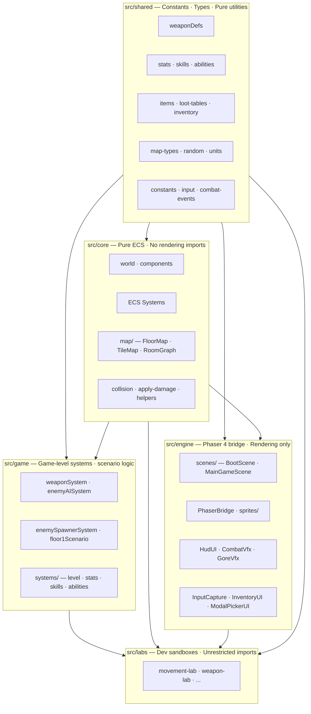
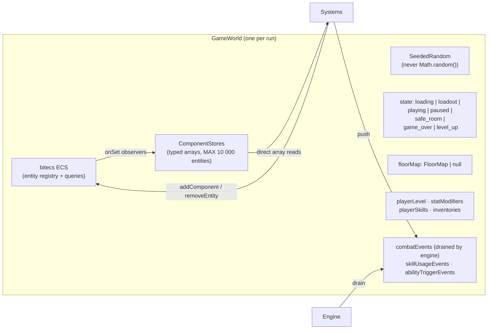
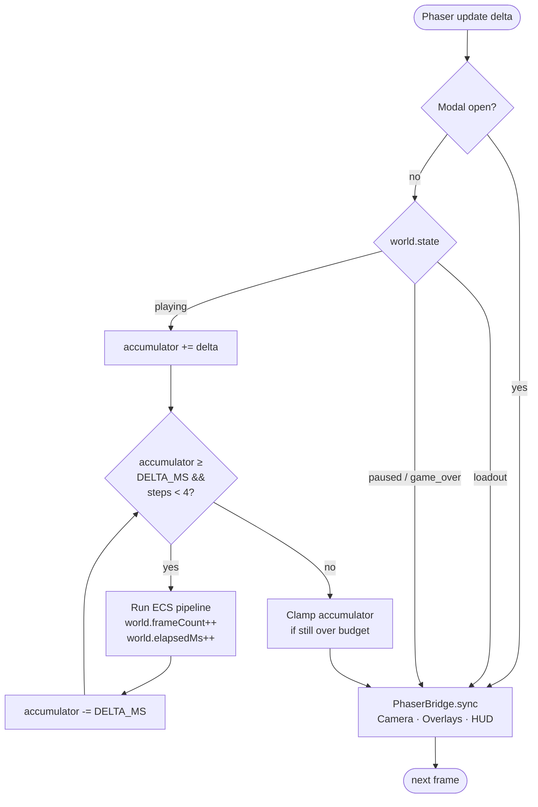
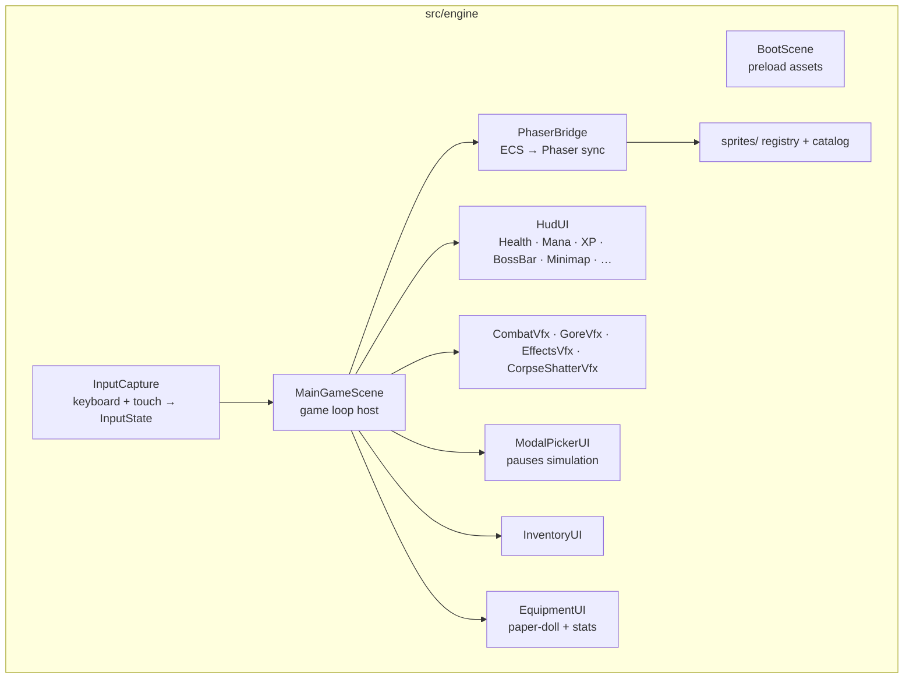

# Crawler — Architecture Overview

> **Status key used throughout this document:**
>
> - ✅ **Implemented** — code ships and has a lab.
> - 🚧 **Partial** — core logic exists but some features are missing or incomplete.
> - 📋 **Planned** — designed in the GDD / ADRs but not yet coded.

---

## Table of Contents

1. [What is Crawler?](#1-what-is-crawler)
2. [Layer Model](#2-layer-model)
3. [ECS Data Model](#3-ecs-data-model)
4. [Game Loop](#4-game-loop)
5. [System Pipeline](#5-system-pipeline)
6. [Systems Catalogue](#6-systems-catalogue)
7. [Engine Subsystems](#7-engine-subsystems)
8. [Planned Systems](#8-planned-systems)
9. [Per-System Docs](#9-per-system-docs)

---

## 1. What is Crawler?

A crafting-focused vampire-survivors-like set inside a brutal intergalactic reality show dungeon. An ancient AI showrunner (_The Director_) narrates your descent through procedurally generated floors while alien audiences bet on your survival.

**Tech stack:** TypeScript (strict) · Phaser 4 · bitecs 0.4 · Vite · Vitest · fast-check

---

## 2. Layer Model

Five layers with strict one-way dependencies enforced by ESLint import rules.



**Rules (enforced by ESLint):**

- `src/core/` must not import from `src/engine/`, `src/game/`, or `src/labs/`
- `src/engine/` must not import from `src/game/` or `src/labs/`
- `src/game/` must not import from `src/engine/` or `src/labs/`
- `src/labs/` is unrestricted

---

## 3. ECS Data Model

Crawler uses **bitecs 0.4** with an observer-based store pattern. Components are plain tag objects; data lives in per-world typed arrays (Float32Array / Uint8Array).



**Adding component data flow:**

```mermaid
sequenceDiagram
    participant Sys as System / Helper
    participant ECS as bitecs ECS
    participant Obs as onSet Observer
    participant Store as TypedArray Store

    Sys->>ECS: addComponent(world.ecs, eid, set(Position, {x,y}))
    ECS->>Obs: fires onSet(Position) for eid
    Obs->>Store: stores.position.x[eid] = x; .y[eid] = y
    Sys->>Store: stores.position.x[eid]  ← direct O(1) read
```

---

## 4. Game Loop

The engine runs a **fixed-timestep accumulator** at 60 Hz (`GAME.DELTA_MS = 16.67 ms`). Up to 4 simulation steps can run per render frame to catch up after hitches; if still over budget, the accumulator is clamped.



---

## 5. System Pipeline

Every step of the simulation runs these systems in order. The sequence is intentional (e.g., drops before health so positions are still valid; door before FOV so new sightlines are visible this frame).


**Weapon & AI systems** run inside `preSystems`/`postSystems` (injected by the Floor 1 scenario — canonical source `src/bootstrap/floor1-main-scene-options.ts`; the visual loop lives in `src/engine/scenes/MainGameScene.ts` and is mirrored headlessly by `src/game/ai/simulation-step.ts`):

```
preSystems: statSystem → floor1PlayerStatSystem
            → weaponSystem → enemyAISystem → statusEffectSystem
            → mobAbilitySystem (default-off gate; enabled by combat-arena lab / future production activation)
            → floor1EnemyDirectorSystem
postSystems: levelSystem → skillSystem → abilitySystem → floorObjectiveSystem → questSystem
```

---

## 6. Systems Catalogue

### Core systems (src/core/systems/)

| System                      | Status | Brief                                                                | Detail                                                                           |
| --------------------------- | ------ | -------------------------------------------------------------------- | -------------------------------------------------------------------------------- |
| `playerInputSystem`         | ✅     | Converts InputState → Player Velocity                                | [Movement & Input](systems/01-movement-input.md)                                 |
| `movementSystem`            | ✅     | Applies Velocity to Position; slide-collision vs tile map            | [Movement & Input](systems/01-movement-input.md)                                 |
| `returningProjectileSystem` | ✅     | Reverse thrown-weapon trajectory when max range exceeded             | [Weapons](systems/03-weapons.md)                                                 |
| `collisionSystem`           | ✅     | Spatial hash grid → CollisionPair[]                                  | [Movement & Input](systems/01-movement-input.md)                                 |
| `aoeOnImpactPreDamage`      | ✅     | Snapshot AoE projectile positions before damage                      | [Combat](systems/02-combat.md)                                                   |
| `damageSystem`              | ✅     | Processes collision pairs → applyDamage, pierce, invincibility       | [Combat](systems/02-combat.md)                                                   |
| `aoeOnImpactPostDamage`     | ✅     | Spawn AoE blasts at snapshotted positions after damage               | [Combat](systems/02-combat.md)                                                   |
| `areaDamageSystem`          | ✅     | Per-frame AoE tick damage from AreaDamage entities                   | [Combat](systems/02-combat.md)                                                   |
| `meleeSwingSystem`          | ✅     | Arc-sweep hit detection for MeleeSwing entities                      | [Combat](systems/02-combat.md)                                                   |
| `knockbackSystem`           | ✅     | Decays Knockback impulse, applies delta to Position                  | [Combat](systems/02-combat.md)                                                   |
| `beamSystem`                | ✅     | Continuous tick damage along a line from LineDamage entities         | [Combat](systems/02-combat.md)                                                   |
| `trapSystem`                | ✅     | Arms on delay, triggers on proximity, spawns AoE blast               | [Combat](systems/02-combat.md)                                                   |
| `itemPickupSystem`          | ✅     | Hoover XP gems, gold, DroppedItems within pickup range               | [Drops & Loot](systems/07-drops-loot.md)                                         |
| `dropSystem`                | ✅     | Spawns Gold/XpGem/DroppedItem on enemy death (≤ 0 HP)                | [Drops & Loot](systems/07-drops-loot.md)                                         |
| `deathTimerSystem`          | ✅     | Delays entity removal for death animation window                     | [Combat](systems/02-combat.md)                                                   |
| `spawnAnimSystem`           | ✅     | Plays spawn-in animation; gates swing-immunity window                | [ADR 0026](knowledge/adr/0026-baby-slime-spawn-animation-and-swing-immunity.md)  |
| `healthSystem`              | ✅     | Removes zero-HP entities; sets game_over for player                  | [Combat](systems/02-combat.md)                                                   |
| `lifetimeSystem`            | ✅     | Removes entities when Lifetime.expiresAtMs is passed                 | [Combat](systems/02-combat.md)                                                   |
| `projectileCleanupSystem`   | ✅     | Removes out-of-bounds projectiles                                    | [Weapons](systems/03-weapons.md)                                                 |
| `doorSystem`                | ✅     | Auto-opens doors near player; syncs tile flags → FOV                 | [Map Generation](systems/06-map-generation.md)                                   |
| `fovSystem`                 | ✅     | Recursive shadowcasting FOV from player tile position                | [Map Generation](systems/06-map-generation.md)                                   |
| `safeRoomSystem`            | ✅     | Sets `world.playerInSafeRoom` from player tile                       | [ADR 0013](knowledge/adr/0013-safe-room-runtime-system.md)                       |
| `npcSystem`                 | ✅     | NPC proximity / interaction-prompt detection                         | [ADR 0012](knowledge/adr/0012-multi-safe-room-and-npc-quest-callback-pattern.md) |
| `statSystem`                | ✅     | Per-frame EffectiveStats recompute (base + points + equipment)       | [Progression](systems/05-progression.md)                                         |
| `equipmentSystem`           | ✅     | Slot equip/unequip; bonuses folded via `effective-stats.ts`          | [Progression](systems/05-progression.md)                                         |
| `questSystem`               | ✅     | Data-driven quest-log eval + feature unlocks (run via `postSystems`) | [ADR 0011](knowledge/adr/0011-data-driven-quest-system.md)                       |
| `mobAbilitySystem`          | ✅     | Generic mob-ability executor (Verdigris Glamour); default-off gate   | [ADR 0064](knowledge/adr/0064-data-driven-boss-ability-catalog.md)               |

### Game systems (src/game/)

| System                      | Status | Brief                                                   | Detail                                             |
| --------------------------- | ------ | ------------------------------------------------------- | -------------------------------------------------- |
| `weaponSystem`              | ✅     | Player auto-fires all 6 weapon types                    | [Weapons](systems/03-weapons.md)                   |
| `enemyAISystem`             | ✅     | Pathfinding + 3 AI personas (Chase, Swarm, Ranged)      | [Enemy AI](systems/04-enemy-ai.md)                 |
| `enemySpawnerSystem`        | ✅     | Timed enemy spawning within bounds                      | [Enemy AI](systems/04-enemy-ai.md)                 |
| `levelSystem`               | ✅     | Accumulates XP; grants stat points on level-up          | [Progression](systems/05-progression.md)           |
| `skillSystem`               | ✅     | Processes SkillUsageEvents; levels skills at thresholds | [Progression](systems/05-progression.md)           |
| `abilitySystem`             | ✅     | Active/passive abilities with trigger conditions        | [Progression](systems/05-progression.md)           |
| `floor1PlayerStatSystem`    | ✅     | Applies Floor 1 scenario base stat bonuses              | [Map Generation](systems/06-map-generation.md)     |
| `floor1EnemyDirectorSystem` | ✅     | Wave-based enemy spawning for Floor 1                   | [Map Generation](systems/06-map-generation.md)     |
| `floorObjectiveSystem`      | ✅     | Floor objective tracking (kill / loot / level / reach)  | [Map Generation](systems/06-map-generation.md)     |
| `spawnerSystem`             | ✅     | Generic Spawner mob-type (finale waves, enrage timers)  | [ADR 0025](knowledge/adr/0025-spawner-mob-type.md) |

### Engine subsystems (src/engine/)

| Subsystem                                                                                             | Status | Brief                                                     | Detail                                                    |
| ----------------------------------------------------------------------------------------------------- | ------ | --------------------------------------------------------- | --------------------------------------------------------- |
| `PhaserBridge`                                                                                        | ✅     | Reads ECS → creates/syncs/destroys Phaser GameObjects     | [Engine Bridge](systems/08-engine-bridge.md)              |
| `InputCapture`                                                                                        | ✅     | Phaser keyboard + touch → InputState                      | [Movement & Input](systems/01-movement-input.md)          |
| `HudUI` (Health · Mana · XP · Loot · Skill · Ability · FloorTimer · BossBar · QuestTracker · Minimap) | ✅     | HUD overlay (≈10 components) synced from world each frame | [Engine Bridge](systems/08-engine-bridge.md)              |
| `CombatVfx`                                                                                           | ✅     | Hit flash / number popups from combatEvents               | [Engine Bridge](systems/08-engine-bridge.md)              |
| `GoreVfx`                                                                                             | ✅     | Blood splatter particles from combatEvents                | [Engine Bridge](systems/08-engine-bridge.md)              |
| `EffectsVfx`                                                                                          | ✅     | Generic juice VFX (sparks, crit bursts, motes)            | [ADR 0025](knowledge/adr/0025-vfx-effects-pipeline.md)    |
| `CorpseShatterVfx`                                                                                    | ✅     | Corpse shards on `corpseExplode` events                   | [ADR 0027](knowledge/adr/0027-corpse-explosion-on-hit.md) |
| `ModalPickerUI`                                                                                       | ✅     | Pause-over modal for loadout / level-up choices           | [Engine Bridge](systems/08-engine-bridge.md)              |
| `InventoryUI`                                                                                         | 🚧     | Inventory display; item interaction not yet wired         | [Drops & Loot](systems/07-drops-loot.md)                  |
| `EquipmentUI`                                                                                         | ✅     | Paper-doll equipment panel (16 slots + live stats)        | [Progression](systems/05-progression.md)                  |
| `sprites/` (catalog + registry)                                                                       | 🚧     | Generated sprite catalog; partial sprite coverage         | [Engine Bridge](systems/08-engine-bridge.md)              |

---

## 7. Engine Subsystems



---

## 8. Planned Systems

These systems are designed in the [Game Design Document](knowledge/game-design/game-design-document.md) or ADRs but have no implementation yet.

| System                            | GDD Reference      | Notes                                                                                                                                                                                                                                                                                                                                                                                                                                                                                                                                               |
| --------------------------------- | ------------------ | --------------------------------------------------------------------------------------------------------------------------------------------------------------------------------------------------------------------------------------------------------------------------------------------------------------------------------------------------------------------------------------------------------------------------------------------------------------------------------------------------------------------------------------------------- |
| 📋 Crafting Bench                 | Tier 2 Crafting    | Safe rooms shipped (ADR 0013); between-floor crafting bench still planned                                                                                                                                                                                                                                                                                                                                                                                                                                                                           |
| 📋 Production Office              | Meta-Progression   | Persistent currency → unlocks across runs                                                                                                                                                                                                                                                                                                                                                                                                                                                                                                           |
| 📋 Broadcast Score accumulation   | Reality show frame | Kill-streak / close-call rating meter                                                                                                                                                                                                                                                                                                                                                                                                                                                                                                               |
| 📋 Sponsor Gifts                  | Broadcast Score    | Care packages between floors                                                                                                                                                                                                                                                                                                                                                                                                                                                                                                                        |
| 📋 Audience Layer                 | Reality show frame | Scrolling chat; vote prompts in safe rooms                                                                                                                                                                                                                                                                                                                                                                                                                                                                                                          |
| 📋 Director Commentary (Ollama)   | Floor AI           | Local LLM narration; floor-load only per ADR                                                                                                                                                                                                                                                                                                                                                                                                                                                                                                        |
| 📋 Generic boss framework         | Floor design       | Floor 1 boss + boss-bar HUD shipped (ADR 0009/0017); reusable multi-floor boss system planned                                                                                                                                                                                                                                                                                                                                                                                                                                                       |
| 📋 Character roster (30+)         | Character system   | Each character = different weapon + passive                                                                                                                                                                                                                                                                                                                                                                                                                                                                                                         |
| 📋 Floor themes (5 sample floors) | Floor design       | Shopping District, Game Show, etc.                                                                                                                                                                                                                                                                                                                                                                                                                                                                                                                  |
| 🚧 Floor 2 — Family Territories   | Floor design       | Systemic cave floor with feuding families, dynamic Win A/B, seeded settlement + shops, HUD family relationships. **Slices 1–8 landed** (`src/game/floor2Scenario.ts`, `src/core/faction-relations.ts`, `src/game/systems/familyFeudSystem.ts`, `src/core/map/generators/cave-system.ts`, `src/shared/data/floors/floor2.manifest.json`). Main-scene bootstrap still targets Floor 1 only. See [systems/09-floor2-family-systems.md](systems/09-floor2-family-systems.md), ADR 0040, and the [spec](../.specify/specs/floor2-family-territories.md). |
| 📋 Season meta-progression        | Rogue-lite layer   | Per-season story arc; Production Office                                                                                                                                                                                                                                                                                                                                                                                                                                                                                                             |
| 📋 Full skill trees per character | Character system   | Brotato-style skill tree depth                                                                                                                                                                                                                                                                                                                                                                                                                                                                                                                      |
| 📋 Multiplayer                    | Deferred           | Out of prototype scope                                                                                                                                                                                                                                                                                                                                                                                                                                                                                                                              |

---

## 9. Per-System Docs

Detailed diagrams, contracts, and cross-system relationships for each system group:

| Document                                                      | Covers                                                                                                                             |
| ------------------------------------------------------------- | ---------------------------------------------------------------------------------------------------------------------------------- |
| [Movement & Input](systems/01-movement-input.md)              | playerInput, movement, collision (spatial hash), InputCapture                                                                      |
| [Combat](systems/02-combat.md)                                | damage, health, knockback, melee swing, beam, trap, AoE, death timer, lifetime                                                     |
| [Weapons](systems/03-weapons.md)                              | weaponSystem (all 6 types), projectile cleanup, returning projectile                                                               |
| [Enemy AI](systems/04-enemy-ai.md)                            | enemyAISystem (3 personas + pathfinding), enemySpawnerSystem                                                                       |
| [Progression](systems/05-progression.md)                      | levelSystem, core statSystem, skillSystem, abilitySystem, equipmentSystem                                                          |
| [Map Generation](systems/06-map-generation.md)                | Generators (Dungeon/Cave/Arena), FloorMap, FOV, doorSystem, Floor 1 scenario                                                       |
| [Drops & Loot](systems/07-drops-loot.md)                      | dropSystem, itemPickupSystem, loot tables, inventory, items                                                                        |
| [Engine Bridge](systems/08-engine-bridge.md)                  | PhaserBridge, HudUI, VFX, ModalPickerUI, sprites                                                                                   |
| [Floor 2 Family Systems](systems/09-floor2-family-systems.md) | factionRelations, family-aware AI, sealed boss dens, dynamic win evaluator, settlement + shops, HUD family relationships (partial) |
