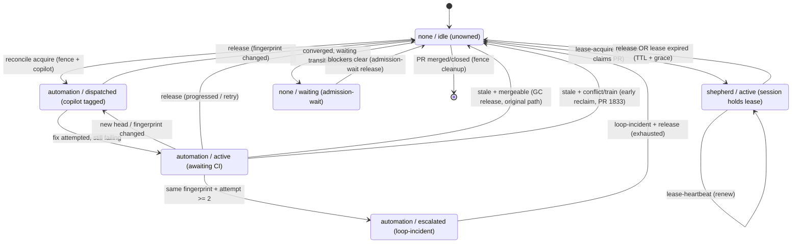
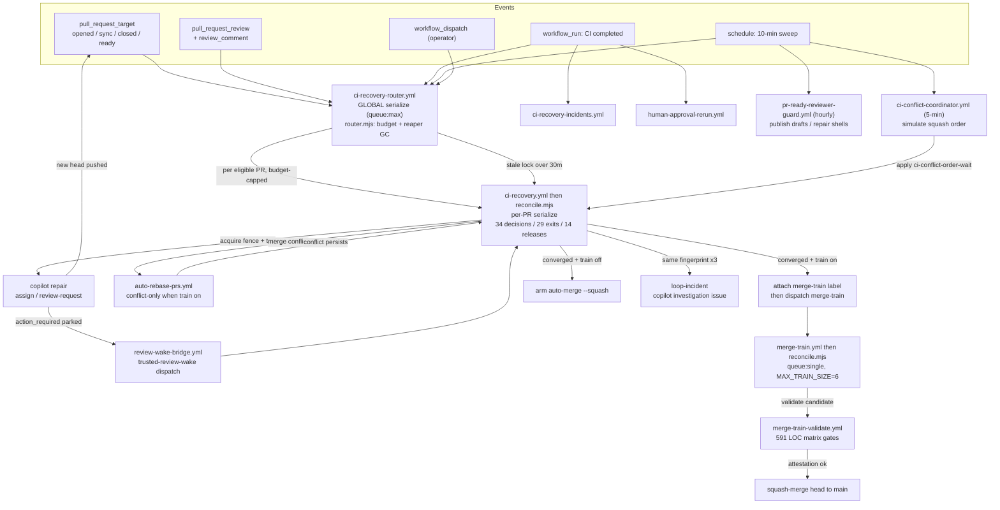

# CI-Recovery / Merge-Train Reconciliation Harness — Holistic Review

**Date:** 2026-07-20
**Author:** merge-remediation session (autopilot)
**Status:** Review complete — redesign precursor. **No code changes.** Documentation + diagrams only.
**Verdict:** The maintainer's hypothesis is **correct**. The harness is over-complex and "too clever," and that complexity is the direct structural cause of the recurring deadlock classes. This document maps the current system so a simplification redesign can start from a shared, accurate picture.

> Scope note: this is an investigation/documentation artifact (docs-only, review-ledger exempt). It describes the system **as it exists on `main` today** and does not propose a specific implementation — it ends with prioritized simplification directions to seed the redesign.

---

## 1. Executive summary

The thing we call "the merge train" is actually **three independent distributed state machines** bolted onto the same pull requests, plus a load-aware dispatcher, coordinated entirely through **GitHub labels and PR comments used as shared mutable state**:

| State machine | Source | What it owns | Coordinates via |
| --- | --- | --- | --- |
| **CI-owner lease** | `.github/scripts/ci-recovery/state.mjs` | Who is "actively working" a PR (`owner × status`) | `ci-owner-pr-N` label + `<!-- crawler-ci-state:v1 -->` comment |
| **Merge-train queue** | `.github/scripts/merge-train/state.mjs` | Admission order + promotion | `merge-train` (queue) / `merge-train-blocked` labels |
| **Conflict ordering** | `.github/scripts/ci-conflict-coordinator/state.mjs` | Squash-order among mutually-conflicting PRs | `ci-conflict-order-wait` label + cluster comment |

No single component is the authoritative owner of a PR's lifecycle. Each machine reads and writes the **same** PRs; a single reconcile pass must reason about all three at once. This **multi-writer / no-owner** topology is the root cause of every recurring deadlock we have hit this cycle.

**Scale of the surface** (non-test source, on `main`):

| Area | Files | LOC |
| --- | ---: | ---: |
| `ci-recovery/` scripts | 12 | 5,747 |
| `merge-train/` scripts | 11 | 4,942 |
| `ci-conflict-coordinator/` scripts | 3 | 1,475 |
| Workflows (`.github/workflows/*.yml`) | 10 | 1,521 |
| **Total (non-test)** | **36** | **≈ 13,685** |

Test code dwarfs this again (`reconcile.test.mjs` alone is ~340 KB). For a system whose job is "merge green PRs into `main` in a safe order," **~13.7K LOC of orchestration logic is the headline complexity signal.**

The single most complex file, `reconcile.mjs` (2,232 LOC), is one **linear top-to-bottom decision cascade** with **34 decision points, 29 `process.exit(0)` calls, and 14 `release()` calls**. Lock-release logic near the bottom (the stale-lease garbage collector) sits **~975 lines below** early short-circuit exits that do **not** check lock ownership. That gap is not incidental — it *is* the mechanism behind the most recent 37-hour lock deadlock (bottleneck #38, PR #1833).

---

## 2. The three state machines

### 2.1 CI-owner lease FSM (the "who's working this PR" lock)

This is the machine the maintainer refers to as "the CI lock mechanism is how we signify there is an active coding session against a PR." It is stored as:

- a repository label `ci-owner-pr-N` attached to the PR (the **fence** / mutex), and
- a `<!-- crawler-ci-state:v1 -->` marker comment carrying base64url-encoded JSON (`owner`, `status`, `headSha`, `progressAt`, `attemptCount`, `blockerFingerprint`, …).

**Owner** ∈ `{ none, automation, shepherd }`. **Status** ∈ `{ idle, dispatched, active, escalated, waiting }`.

- `automation` = the recovery bot is driving (it tagged `@copilot`, is waiting on CI, etc.).
- `shepherd` = a coding-agent/human session has explicitly claimed the PR via a `lease-acquire` operation and heartbeats it (TTL 30 min + 5 min grace). While a **healthy** shepherd lease is held, automation reconcile **skips** the PR entirely — this is the "active session" signal.
- `none` = unowned/quiescent.

**Lease/reclaim helpers** (`state.mjs`):

- `isLeaseExpired(state)` — **only** meaningful for `owner==='shepherd' && status==='active'` (returns `false` for automation; automation staleness is a separate concept).
- `AUTOMATION_STALE_MINUTES = 30` — the automation liveness horizon.
- `isDuplicateDispatch(state, fp)` — `owner==='automation' && status ∈ {active,dispatched,escalated} && fingerprint matches`.
- `automationStallAction(...)` — the retry ladder: returns `new | progressed | wait | retry | release`; ceiling `stallAttempt >= 2 → release`.
- `blockerFingerprint(...)` — SHA-256 over the blocker set, **deliberately excluding `line` and `url`** (a run-ID embedded in a URL made every rerun look "progressed," creating an immortal lock — a real past bug this exclusion fixes).

### 2.2 Merge-train queue FSM (admission + promotion)

`merge-train/state.mjs` + `reconcile-lib.mjs` (1,331 LOC) + `reconcile.mjs` (872 LOC). Queue capacity `MAX_TRAIN_SIZE = 6`; admission checks `['ci', 'Security checks']`. A PR is "cargo" only when it carries the `merge-train` label **and** its `crawler-ci-state` comment matches the **live** head SHA. Promotion validates the candidate via `merge-train-validate.yml` (591 LOC — the single largest workflow) and squash-merges the head.

**The critical admission gotcha** (bottleneck, high severity): the *only* correct way to enroll a PR is to **dispatch a ci-recovery reconcile on the UNLABELED PR** — reconcile atomically writes a fresh state comment *and* attaches the `merge-train` label in one pass. **Hand-adding the `merge-train` label first deadlocks admission**: reconcile then hits the merge-train-owned short-circuit *before* it can record fresh state, so the state comment stays stale forever and the train's `eligible()` gate rejects it with "admission evidence is stale." The enrollment lever and a permanent deadlock are the *same action* performed in the wrong order.

### 2.3 Conflict-ordering FSM (squash-order among conflicting PRs)

`ci-conflict-coordinator/reconcile.mjs` (850 LOC) + `state.mjs` (483 LOC). Runs every 5 min. It simulates squash-merges to compute a merge order among mutually-conflicting PRs and applies `ci-conflict-order-wait` labels so predecessors land first. Its cluster snapshot can go **stale** (it escalated #1789 against a cluster that still listed already-merged PRs), producing a *hypothetical-ordering* conflict that is not a conflict against real `main`.

---

## 3. Workflow / event-flow topology

Ten workflows feed the three machines. `ci-recovery-router.yml` is the front door: it serializes all events (`concurrency: crawler-ci-recovery-router, queue:max`), computes a load-aware dispatch budget, and fans out per-PR `ci-recovery.yml` reconcile runs (per-PR serialized).

**Concurrency model** (multi-level serialization is itself a source of subtle races):

| Group | Policy | Effect |
| --- | --- | --- |
| `crawler-ci-recovery-router` | `queue:max` | All router runs serialize; no events dropped |
| `crawler-ci-pr-N` | `queue:max` | Per-PR reconcile serialized; different PRs run in parallel |
| `crawler-merge-train` | `queue:single` | Train admission strictly one-at-a-time |
| `crawler-ci-conflict-coordinator` | default (cancel) | Latest coordinator run wins |

---

## 4. Recurring deadlock taxonomy → structural root cause

Every deadlock we hit this cycle maps to a specific over-complexity in the topology above. This is the core evidence for "too clever."

| # | Deadlock class | Symptom seen | Structural root cause |
| --- | --- | --- | --- |
| D1 | **Admission double-meaning** | Hand-labeling `merge-train` permanently stalls a PR | The enrollment lever *is* the deadlock action when ordered wrong; state-comment-must-match-live-head couples two machines |
| D2 | **Conflict-only rebase gap** | Clean-but-`BEHIND` PRs (#1799) never merge | Auto-rebase only fires on *conflict*; strict up-to-date policy then blocks a green PR nothing rebased |
| D3 | **Review-wake ≠ repair-wake** | Broken idle PRs never get re-engaged | `shouldRequestReview` bails exactly when `hasMergeConflict \|\| !checksPassing \|\| blockers>0`; it wakes *reviews*, never *repairs*. Once the authoring session goes idle, **nothing** re-tags `@copilot`. **Still open — the biggest live gap.** |
| D4 | **Fingerprint churn → immortal lock** | Lock never released; every rerun looked "progressed" | `blockerFingerprint` originally hashed a run-ID-bearing URL; fixed by excluding `url`/`line` — but the fragility is inherent to fingerprint-based identity |
| D5 | **Release unreachable behind short-circuits** | #1759 held `ci-owner` lock ~37h | GC sits ~975 lines below owner-blind `process.exit(0)` short-circuits in one linear cascade (bottleneck #38 → PR #1833 early-reclaim patch) |
| D6 | **Orphaned fences on closed PRs** | 13 stale `ci-owner-pr-N` labels on merged PRs | Fence cleanup only runs *inside* a reconcile; closed PRs receive no reconcile events, so the label is never swept (bottleneck #40) |
| D7 | **Bot-pushed `action_required` parking** | Armed auto-merge sits forever (#1811) | A bot push with the same App token parks required CI in `action_required`; contexts never post; only a different-identity push re-triggers |
| D8 | **INDEX.md serializes the queue** | 6/11 open PRs `DIRTY` at once | Nearly every PR regenerates `docs/knowledge/handoffs/INDEX.md`, so *every* concurrent PR conflicts after each merge — the generated file effectively serializes the whole queue |
| D9 | **Stale conflict-cluster ordering** | #1789 escalated against already-merged PRs | Coordinator's simulated cluster snapshot goes stale; its "escalated" verdict is a hypothetical, not a real-`main` conflict |
| D10 | **Router↔reconcile TOCTOU** | Budget can be breached under concurrent runs | Router reads outstanding-run count then dispatches; reconcile is not part of the router's serialization group (documented in `router.mjs`, mitigated not closed) |

**Pattern:** D1, D5, D6, D9 are all the same disease — **state that is only advanced *inside* a reconcile pass, guarded by owner-blind early exits, coordinated across machines through labels.** When the triggering event never arrives (closed PR, short-circuited PR, stale cluster), the state is frozen with no independent liveness sweep to correct it.

---

## 5. Complexity smells (the "too clever" catalog)

1. **Three FSMs, no owner.** A PR's fate is decided by the *interaction* of ci-owner + merge-train + conflict-order state, none authoritative. Reasoning about one requires holding all three in your head.
2. **Labels + comments as a database.** Distributed mutable state lives in GitHub labels and base64url-in-a-comment. Multiple workflows write the same labels; there is no transaction, so every writer re-derives eligibility and hopes for the best.
3. **One 2,232-line linear cascade.** `reconcile.mjs` is a top-to-bottom decision tree with 29 exits. Adding *any* release/skip means proving it is correct relative to all 28 other exits and the ~975-line gap to the GC. The #1833 fix had to insert an **early** reclaim rather than fix the GC's position — the cascade shape resisted the natural fix.
4. **Identity by fingerprint.** "Is this the same problem as last cycle?" is answered by hashing a blocker set. Every field that leaks run-scoped data (url, line) silently breaks liveness. Fragile by construction.
5. **Wake semantics split from repair semantics.** The only per-PR re-engagement lever (`shouldRequestReview`) is a *review* wake that self-disables on broken PRs. There is no first-class "this PR is broken and its session is idle → repair it" transition (D3).
6. **Gate logic duplicated across YAML.** The `schedule && train-enabled` guard is replicated in ≥3 workflows; the managed-comment marker filter is hand-maintained across files. Adding a marker is a 3-file edit.
7. **Reaper is the only liveness source, and it is event-gated.** Stale locks are only reaped when a reconcile runs. Anything that stops receiving reconcile events (closed PR, exhausted budget day) has no backstop.
8. **Throttles in multiple places.** Dispatch caps live in `router.mjs` (`MAX_DISPATCH_BUDGET_TRAIN_BUSY=5`, `_IDLE=8`, `GLOBAL_TRAIN_DISPATCH_CAP=5`, `DEFAULT_MAX_DISPATCH_PER_RUN=8`) and are per-*run*, not per-*window*, so coincident triggers still burst (observed 15 dispatches in one bucket).

---

## 6. What is actually working (don't throw it away)

- **Global router serialization + load-aware budget** prevents thundering-herd storms; steady-state cadence stays within budget.
- **Review-round throttle** holds — 7/9 sampled PRs saw exactly one Copilot review run; no runaway review loops.
- **Per-PR concurrency** correctly lets different PRs reconcile in parallel while serializing same-PR runs.
- **`expected_head_sha` binding** makes dispatches fail-closed on a head move — the right instinct for a distributed system.
- **Deterministic, test-heavy.** The behavior is pinned by a very large test suite; a redesign can lean on it as a characterization harness.

---

## 7. Simplification directions (redesign precursor — not yet a proposal)

Ordered by leverage. These are directions to evaluate, not decisions.

1. **Collapse to one authoritative PR-lifecycle state machine.** One owner of "what phase is this PR in" (repairing / queued / ordering / merging / done), with the other two machines demoted to *pure functions* that answer questions ("is this PR admissible?", "who must land first?") rather than independently mutating PR state. This directly attacks D1/D5/D9.
2. **Add an event-independent liveness sweep.** A single periodic reconciler that owns *all* stale-state reclamation (expired shepherd leases, stale automation locks, orphaned fences on closed PRs, stale conflict clusters) — so liveness never depends on the triggering event arriving. Attacks D5/D6/D9.
3. **Make "repair" a first-class transition.** Split repair-wake from review-wake: a broken PR whose lease is stale/idle must have an explicit `→ dispatch @copilot repair` edge. Attacks D3 (the biggest open gap).
4. **Replace the linear cascade with an explicit dispatch table.** A `(owner, status, blockers, train-state) → action` table (data, not 29 `process.exit`s) makes it impossible to add a release below an owner-blind exit. Attacks D5 and the whole of §5.3.
5. **Decouple the queue from `INDEX.md`.** Stop regenerating a single shared file on every PR (or move it out of the merge path). Attacks D8 — likely the highest *throughput* win.
6. **Always-rebase, not conflict-only.** Under strict up-to-date, a clean `BEHIND` PR must be rebased too. Attacks D2.
7. **Centralize gates + markers.** One reusable "train-enabled + schedule" gate action and one shared marker constant. Removes the 3-file-edit fragility (§5.6).

A reasonable sequencing: **(1)+(4)** together (the structural core), then **(2)+(3)** (liveness + repair), then **(5)+(6)+(7)** (throughput + ergonomics). Each can be characterized against the existing test suite before behavior changes.

---

## 8. Appendix — key citations

- **CI-owner state model:** `.github/scripts/ci-recovery/state.mjs` — `DEFAULT_LEASE_TTL_MINUTES=30`, `DEFAULT_LEASE_GRACE_MINUTES=5`, `AUTOMATION_STALE_MINUTES=30`; `isLeaseExpired` (shepherd-only), `isDuplicateDispatch`, `automationStallAction`, `blockerFingerprint` (excludes `url`/`line`), `isHealthyRecoveryOwner`.
- **The linear cascade + gap:** `.github/scripts/ci-recovery/reconcile.mjs` (2,232 LOC) — early stale-automation reclaim (~L1207, PR #1833), merge-train-owned short-circuit (~L1231, owner-blind), ci-conflict-order-wait short-circuit (~L1240, owner-blind), stale-automation GC (~L2182). 34 decision points / 29 `process.exit(0)` / 14 `release()`.
- **Dispatcher + budget + reaper:** `.github/scripts/ci-recovery/router.mjs` (904 LOC) — `computeDispatchBudget`, `identifyReapablePrs`, dispatch caps.
- **Repair-wake gap:** `.github/scripts/ci-recovery/review-request.mjs` (`shouldRequestReview` second guard) — D3.
- **Merge-train:** `.github/scripts/merge-train/{reconcile-lib.mjs,reconcile.mjs,state.mjs}`; `MAX_TRAIN_SIZE=6`, admission `['ci','Security checks']`.
- **Conflict ordering:** `.github/scripts/ci-conflict-coordinator/{reconcile.mjs,state.mjs}`.
- **Workflows:** `ci-recovery-router.yml`, `ci-recovery.yml`, `merge-train.yml`, `merge-train-validate.yml` (591 LOC), `auto-rebase-prs.yml`, `ci-conflict-coordinator.yml`, `ci-recovery-review-wake-bridge.yml`, `ci-recovery-incidents.yml`, `human-approval-rerun.yml`, `pr-ready-reviewer-guard.yml`.
- **Deadlock evidence:** session bottleneck ledger (this remediation cycle) — admission double-meaning, conflict-only-rebase gap, review-vs-repair wake gap, fingerprint churn, release-unreachable (#38→#1833), orphaned fences (#40), bot-push parking, INDEX.md serialization, stale conflict clusters, router↔reconcile TOCTOU.
