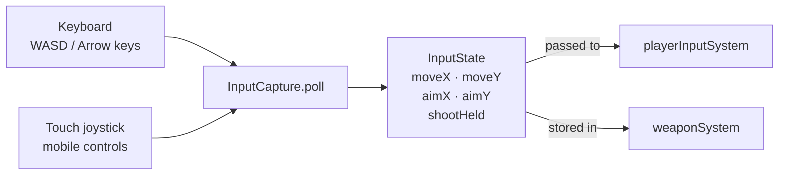
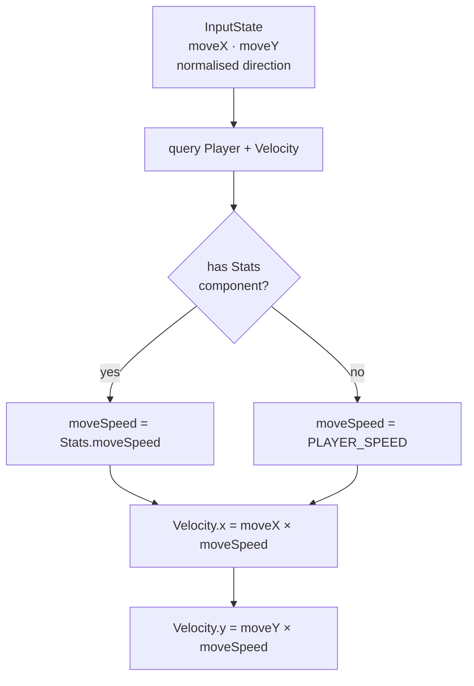
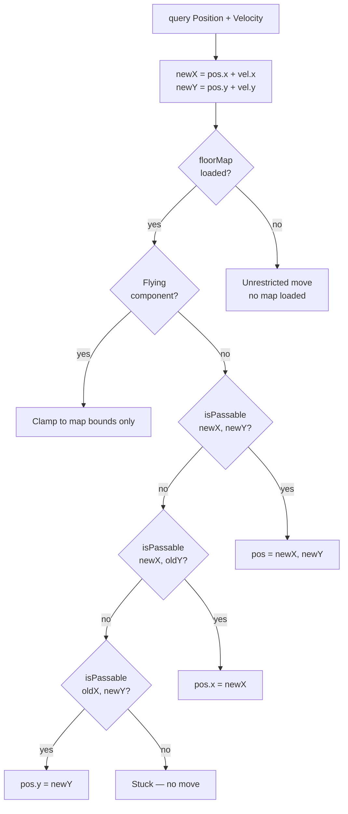
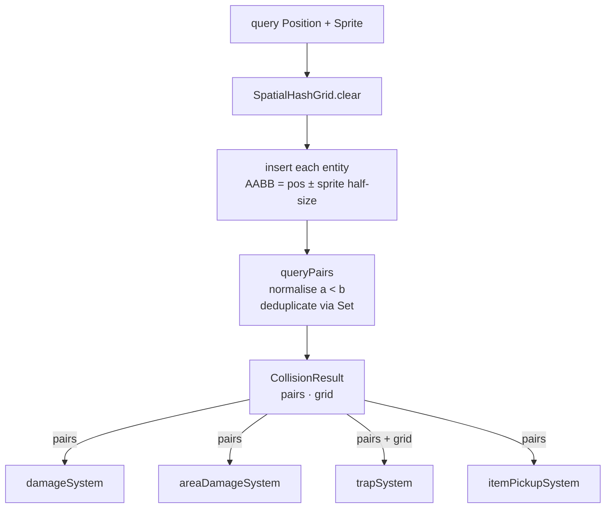
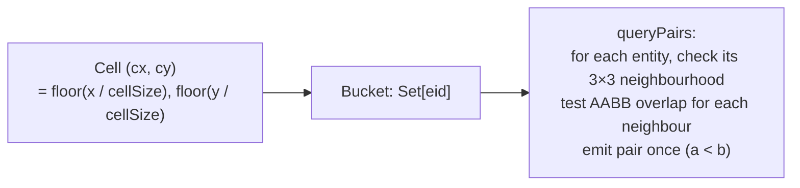
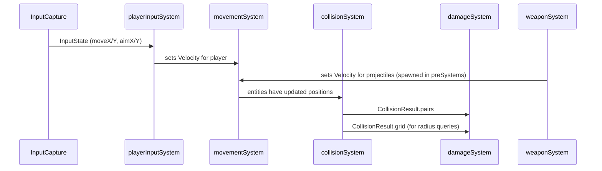

# Movement & Input Systems

**Status:** ✅ Implemented  
**Layer:** `src/core/systems/` + `src/engine/InputCapture.ts`  
**Lab:** `movement-lab`, `playerinput-lab`, `collision-lab`

---

## Systems in this group

| System              | File                                    | Runs at                       |
| ------------------- | --------------------------------------- | ----------------------------- |
| `InputCapture`      | `src/engine/InputCapture.ts`            | every Phaser frame (pre-step) |
| `playerInputSystem` | `src/core/systems/playerInputSystem.ts` | step 1 of pipeline            |
| `movementSystem`    | `src/core/systems/movementSystem.ts`    | step 3                        |
| `collisionSystem`   | `src/core/systems/collisionSystem.ts`   | step 4                        |

---

## InputCapture

### What it does

Bridges Phaser's keyboard events and mobile touch joystick into the shared `InputState` struct. Runs once per Phaser render frame before the fixed-step simulation.

### Contract

```
Inputs:  Phaser.Scene keyboard events + pointer/touch events
Outputs: InputState { moveX, moveY, aimX, aimY, shootHeld, ... }
```

### Diagram



---

## playerInputSystem

### What it does

Reads `InputState.moveX/moveY` (already normalised to unit length) and writes the player entity's `Velocity` component. Uses `Stats.moveSpeed` when the `Stats` component is present, otherwise falls back to `PLAYER_SPEED`.

### Contract

```
Reads:   InputState, Stats.moveSpeed (optional)
Writes:  Velocity.x, Velocity.y for all entities with [Player, Velocity]
Side effects: none
```

### Diagram



---

## movementSystem

### What it does

Applies `Velocity` to `Position` each simulation step. If a `FloorMap` is loaded it performs tile-level slide-collision: tries the full move first, then X-only, then Y-only. Flying entities only respect map bounds, not wall tiles.

### Contract

```
Reads:   Position.x/y, Velocity.x/y, FloorMap.isPassableAt()
Writes:  Position.x, Position.y
Side effects: none (pure transform, no entities created/destroyed)
```

### Diagram



---

## collisionSystem

### What it does

Inserts every entity with `[Position, Sprite]` into a `SpatialHashGrid` (cell size = 64 px), then runs `queryPairs()` to produce all overlapping AABB pairs this frame. The result is passed by value to `damageSystem`, `areaDamageSystem`, `trapSystem`, and `itemPickupSystem`.

### Contract

```
Reads:   Position.x/y, Sprite.width/height for all entities with [Position, Sprite]
Returns: CollisionResult { pairs: CollisionPair[], grid: SpatialHashGrid }
  CollisionPair { a: eid, b: eid }  — always a < b (deduplicated)
Side effects: clears and rebuilds the shared SpatialHashGrid each step
```

### Diagram



### SpatialHashGrid internals



---

## How these systems relate to the rest of the pipeline


