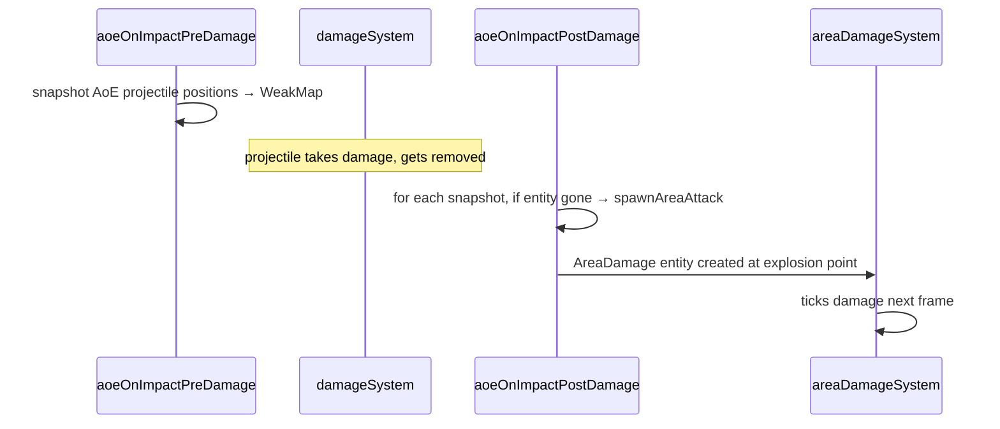
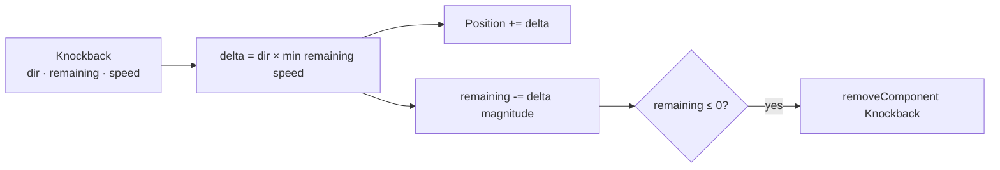
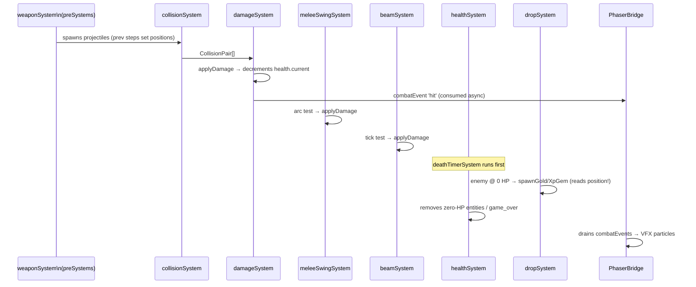

# Combat Systems

**Status:** ✅ Implemented  
**Layer:** `src/core/systems/`  
**Labs:** `combat-lab`, `damage-lab`, `health-lab`, `knockback-lab`, `deathtimer-lab`, `lifetime-lab`

---

## Systems in this group

| System                  | File                   | Pipeline position |
| ----------------------- | ---------------------- | ----------------- |
| `aoeOnImpactPreDamage`  | `aoeOnImpactSystem.ts` | 5                 |
| `damageSystem`          | `damageSystem.ts`      | 6                 |
| `aoeOnImpactPostDamage` | `aoeOnImpactSystem.ts` | 7                 |
| `areaDamageSystem`      | `areaDamageSystem.ts`  | 8                 |
| `meleeSwingSystem`      | `meleeSwingSystem.ts`  | 9                 |
| `knockbackSystem`       | `knockbackSystem.ts`   | 10                |
| `beamSystem`            | `beamSystem.ts`        | 11                |
| `trapSystem`            | `trapSystem.ts`        | 12                |
| `deathTimerSystem`      | `deathTimerSystem.ts`  | 15                |
| `healthSystem`          | `healthSystem.ts`      | 16                |
| `lifetimeSystem`        | `lifetimeSystem.ts`    | 17                |

---

## Shared damage primitive: `applyDamage`

All combat paths converge on `applyDamage(world, targetEid, amount, opts)` in `src/core/apply-damage.ts`. It:

1. Checks armour (from `Stats.armor` if present).
2. Clamps damage to `[0, health.current]`.
3. Decrements `health.current`.
4. Pushes a `CombatEvent` onto `world.combatEvents` (consumed by `PhaserBridge` for VFX).
5. Returns the actual damage dealt.

---

## damageSystem

### What it does

Iterates every `CollisionPair` from `collisionSystem`. For each pair it determines whether it is a valid hit (one side has `Health`, the other has `Damage`/`Projectile`) and calls `applyDamage`. Respects a **250 ms per-entity invincibility window** for the player.

### Contract

```
Reads:   CollisionResult.pairs
         Damage.amount, Health.current, Projectile.pierce/hitCount
         Player (invincibility), EnemyProjectile, Stats.armor
Writes:  health.current[eid] (decremented)
         projectile.hitCount[eid] (incremented for pierce tracking)
         world.combatEvents (pushed)
Removes: projectile entity when pierce exhausted
Side effects: emits 'hit'/'blocked' CombatEvents
```

### Diagram

```mermaid
flowchart TD
    PAIRS[CollisionPair[]from collisionSystem]
    CHK{valid hit?\none has Health\nother has Damage}
    INV{Player hit within\n250ms window?}
    PIERCE{Projectile pierce\nexhausted?}
    APPLY[applyDamage\ncombatEvent 'hit']
    BLOCK[combatEvent 'blocked'\nskip damage]
    REMOVE[removeEntity projectile]
    SKIP[skip pair]

    PAIRS --> CHK
    CHK -- yes --> INV
    CHK -- no --> SKIP
    INV -- yes --> BLOCK
    INV -- no --> APPLY
    APPLY --> PIERCE
    PIERCE -- yes --> REMOVE
```

---

## aoeOnImpact (Pre + Post damage)

### What it does

Handles AoE explosions when a projectile with `AoeOnImpact` hits something.

- **Pre-damage**: Snapshots `{eid, x, y, radius, damage, ownerEid, teamId}` for every `AoeOnImpact` entity that is about to be damaged.
- **Post-damage**: For each snapshot whose entity was removed (i.e. projectile landed), spawns an `AreaDamage` burst entity at the recorded position.

### Contract

```
Pre-damage reads:  AoeOnImpact entities, their Position, Owner, Team
Pre-damage writes: internal WeakMap snapshot
Post-damage reads: snapshot WeakMap, entity existence
Post-damage writes: spawnAreaAttack (AreaDamage entity at explosion pos)
```

### Diagram



---

## areaDamageSystem

### What it does

Each frame queries all `AreaDamage` entities and, for every entity with `Health` in the affected radius, calls `applyDamage`. Respects `hitOnce` (single detonation) and optional arc limits (`arcCenterRad`, `arcHalfRad`).

### Contract

```
Reads:   AreaDamage.{radius, damage, hitOnce, arcCenterRad, arcHalfRad}
         CollisionResult.grid (for radius query)
         Team.id (friendly fire prevention)
Writes:  health.current[target] via applyDamage
         world.combatEvents
Removes: AreaDamage entity when hitOnce=1 after first tick
```

---

## meleeSwingSystem

### What it does

Queries `MeleeSwing` entities (spawned by `weaponSystem`). For each swing it tests whether enemy entities fall within the blade arc using angle and distance checks. Respects per-swing hit deduplication so a single swing can't hit the same enemy twice.

### Contract

```
Reads:   MeleeSwing.{bladeLength, arcCenterRad, arcHalfRad, damage, style,
                    headRadius, shaftDamageMult, knockback, durationMs, spawnAtMs}
         Enemy positions (via SpatialHashGrid radius query or brute-force)
         Team.id
Writes:  applyDamage on each hit enemy
         Knockback component added to hit enemies
         world.combatEvents
Side effects: deduplication set prevents re-hitting same enemy per swing
```

### Swing styles

```
SLASH (0): Sweeping arc — wide area, shaft has reduced damage multiplier
STAB  (1): Thrust — narrow cone, head radius at tip deals bonus damage
```

---

## knockbackSystem

### What it does

Decays the `Knockback` impulse each frame. Applies the remaining velocity as a Position delta. Removes the `Knockback` component when `remaining ≤ 0`.

### Contract

```
Reads:   Knockback.{dirX, dirY, remaining, speed}
Writes:  Position.x/y (delta = dir × min(remaining, speed))
         Knockback.remaining -= applied amount
Removes: Knockback component when exhausted
```

### Diagram



---

## beamSystem

### What it does

Queries `LineDamage` entities (beams spawned by the beam weapon). Each tick interval (`tickMs`) performs a segment vs AABB test against all enemies along the beam's length and direction. Applies damage once per tick per enemy.

### Contract

```
Reads:   LineDamage.{dirX, dirY, length, damage, tickMs, lastTickMs}
         world.elapsedMs (tick gating)
         Enemy positions
Writes:  LineDamage.lastTickMs
         applyDamage on each enemy hit this tick
         world.combatEvents
```

---

## trapSystem

### What it does

Two phases per `Trap` entity:

1. **Arming** — ignores enemies until `armAtMs` is reached.
2. **Trigger** — when any enemy enters `triggerRadius`, spawns an `AreaDamage` blast with `explosionRadius`/`explosionDamage`, then removes the trap.

### Contract

```
Reads:   Trap.{triggerRadius, explosionRadius, explosionDamage, armAtMs}
         CollisionResult.grid (radius query)
         world.elapsedMs
         Enemy entities
Writes:  spawnAreaAttack → AreaDamage entity
Removes: Trap entity after trigger
```

---

## deathTimerSystem

### What it does

Decrements `DeathTimer.remainingMs` each step. When expired, clears the entity's stores and removes it. This gives the rendering layer a window to play death animations.

### Contract

```
Reads:   DeathTimer.remainingMs
         world.elapsedMs (via GAME.DELTA_MS per step)
Writes:  DeathTimer.remainingMs -= DELTA_MS
Removes: entity (clearEntityStores + removeEntity) when remainingMs ≤ 0
```

---

## healthSystem

### What it does

Runs after `dropSystem` and `deathTimerSystem`. Finds entities with `health.current ≤ 0` that do not have a `DeathTimer` (those are handled by `deathTimerSystem`). Removes dead non-player entities; transitions to `game_over` for the player.

### Contract

```
Reads:   Health.current, Player, Enemy, DeathTimer components
Writes:  world.state = 'game_over' (if player dies)
Removes: dead non-player entities (clearEntityStores + removeEntity)
```

---

## lifetimeSystem

### What it does

Removes any entity whose `Lifetime.expiresAtMs` has been passed by `world.elapsedMs`. Used for projectiles with fixed lifespans, temporary effects, and area bursts.

### Contract

```
Reads:   Lifetime.expiresAtMs, world.elapsedMs
Removes: entity when elapsedMs ≥ expiresAtMs (clearEntityStores + removeEntity)
```

---

## Full combat resolution flow


