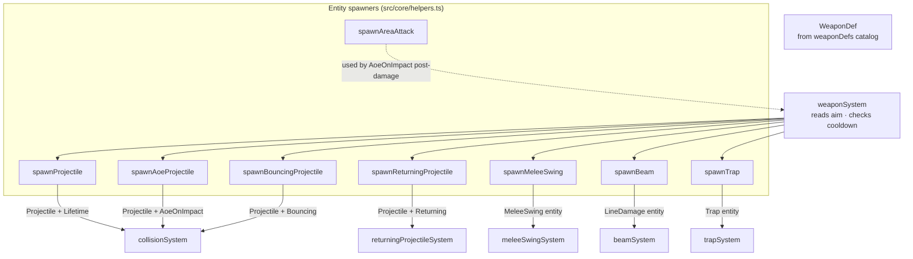
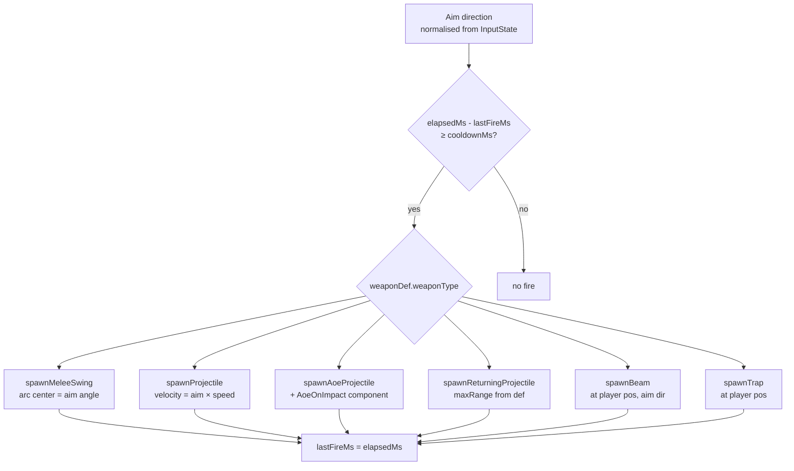
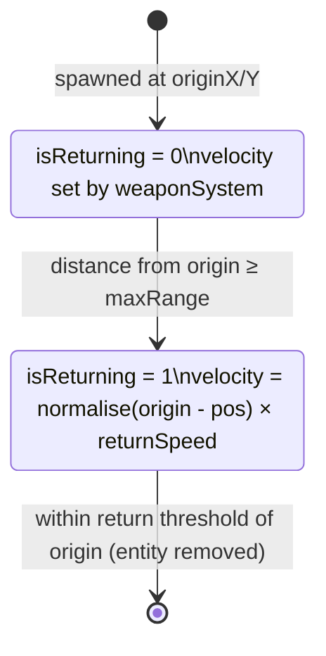
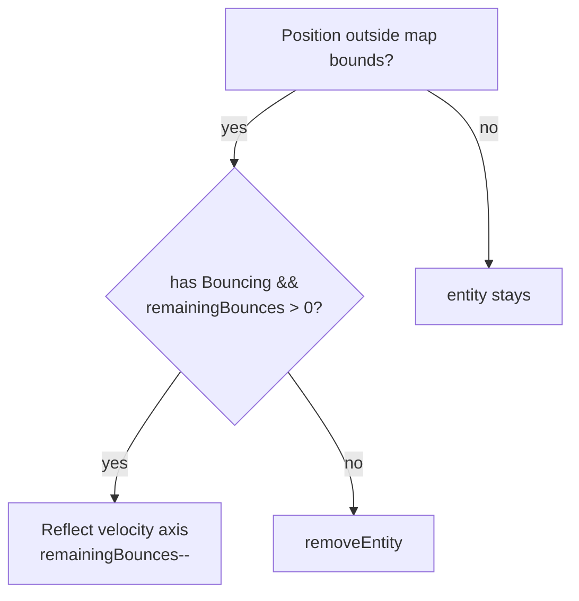
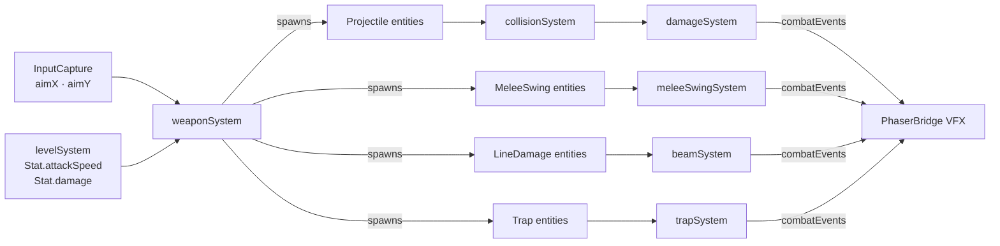

# Weapon Systems

**Status:** ✅ Implemented  
**Layer:** `src/game/weaponSystem.ts` + `src/core/systems/`  
**Labs:** `weapon-lab`, `projectilecleanup-lab`

---

## Systems in this group

| System                      | File                                            | Pipeline position           |
| --------------------------- | ----------------------------------------------- | --------------------------- |
| `weaponSystem`              | `src/game/weaponSystem.ts`                      | preSystems (player weapons) |
| `returningProjectileSystem` | `src/core/systems/returningProjectileSystem.ts` | 3                           |
| `projectileCleanupSystem`   | `src/core/systems/projectileCleanupSystem.ts`   | 18                          |

---

## Overview

The weapon system is the primary source of combat projectiles and attack entities. It reads the player's aim direction and active `WeaponDef`, then spawns the appropriate attack entity each cooldown cycle. Enemy weapons follow the same `WeaponDef` schema but are driven by `enemyAISystem` aim data.



---

## Weapon types

Six weapon types are defined in `WeaponType` and handled by `weaponSystem`:

| Type     | Constant | Spawn helper               | Key mechanics                                          |
| -------- | -------- | -------------------------- | ------------------------------------------------------ |
| `MELEE`  | 0        | `spawnMeleeSwing`          | Arc sweep; SLASH vs STAB style; shaft/head damage      |
| `RANGED` | 1        | `spawnProjectile`          | Standard hitscan-ish projectile with pierce + bounce   |
| `MAGIC`  | 3        | `spawnAoeProjectile`       | Explodes on impact (AoeOnImpact)                       |
| `THROWN` | 4        | `spawnReturningProjectile` | Travels to max range then returns to owner             |
| `BEAM`   | 5        | `spawnBeam`                | Continuous line damage; tick interval                  |
| `TRAP`   | 6        | `spawnTrap`                | Placed at player pos; arms on delay; proximity trigger |

---

## weaponSystem contract

```
Reads:   InputState.aimX/Y, InputState.shootHeld
         world.elapsedMs (cooldown gating)
         Active WeaponDef (set via setActiveWeapon())
         Stats.{damage, attackSpeed, projectileCount, projectileSpeed} (if present)
Writes:  spawns attack entity each cooldown cycle
         WeaponState.lastFireMs
Side effects: none beyond entity spawn
```

### Cooldown and firing



---

## returningProjectileSystem

### What it does

Manages the return trajectory for `Returning` (thrown weapon) projectiles:

1. While `isReturning = 0`: tracks distance from origin, flips `isReturning = 1` when `maxRange` exceeded.
2. While `isReturning = 1`: steers velocity toward `originX/Y`; removes entity when close enough.

### Contract

```
Reads:   Returning.{returnSpeed, isReturning, maxRange, originX, originY}
         Position.x/y
Writes:  Returning.isReturning (flip to 1 at max range)
         Velocity.x/y (towards origin when returning)
Removes: entity when returned to origin (within threshold)
```

### Diagram



---

## projectileCleanupSystem

### What it does

Removes projectile entities (`[Projectile, Position]`) that have left the floor map bounds or whose `Bouncing` component has exhausted all bounces.

### Contract

```
Reads:   Position.x/y, floorMap bounds (if loaded)
         Bouncing.remainingBounces
Writes:  Bouncing.remainingBounces (decremented on wall hit)
         Velocity.x/y (reflected on wall hit)
Removes: Projectile entity when out of bounds (and no bounces left)
```

### Bouncing logic



---

## WeaponDef catalog

All weapon definitions live in `src/shared/weaponDefs.ts`. Weapons referenced by Floor 1 starter pool:

| id               | Type          | Base DMG | Cooldown |
| ---------------- | ------------- | -------- | -------- |
| `sword`          | MELEE (SLASH) | 15       | 600 ms   |
| `knife`          | MELEE (STAB)  | 8        | 300 ms   |
| `bow`            | RANGED        | 12       | 700 ms   |
| `pistol`         | RANGED        | 10       | 500 ms   |
| `throwing-knife` | THROWN        | 6        | 350 ms   |

Additional weapons in catalog: `crossbow`, `wand`, `staff`, `shotgun`, `flamethrower`, `trap-mine`, `grenade`, and more.

---

## Relationships to other systems


