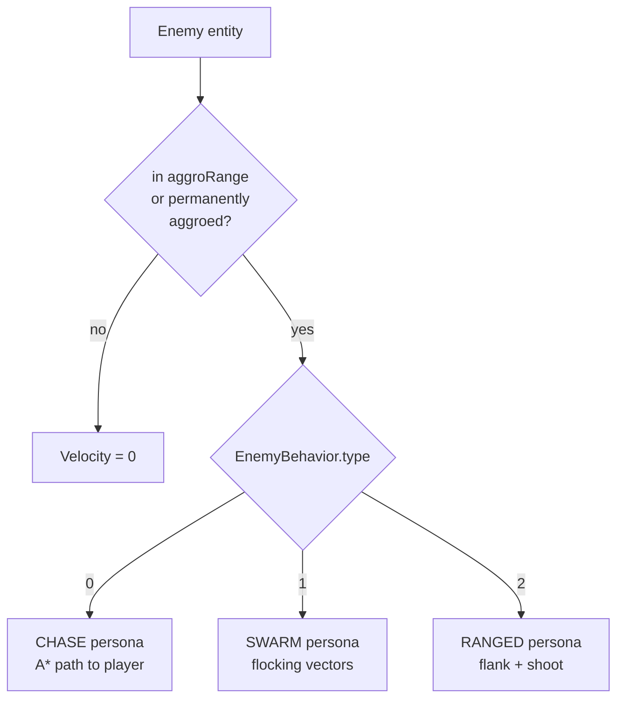
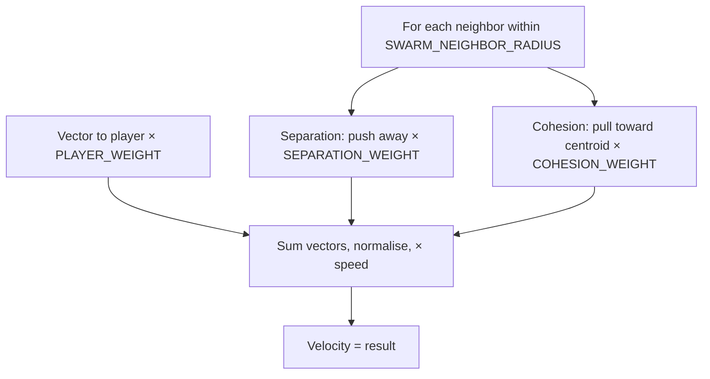
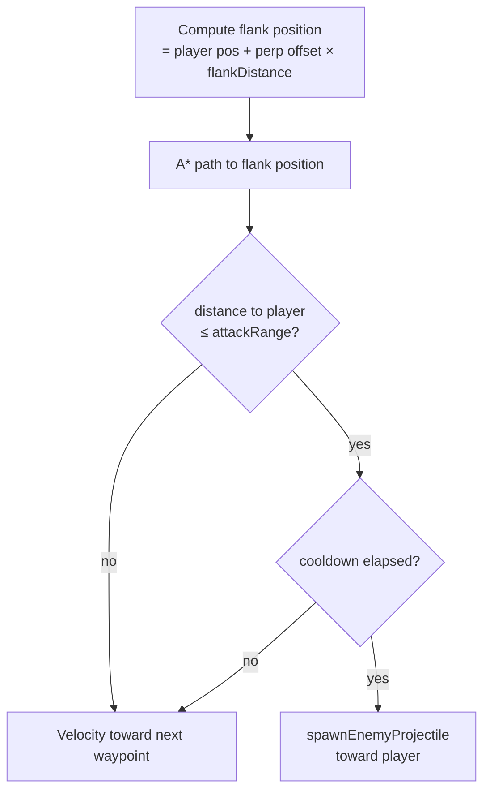
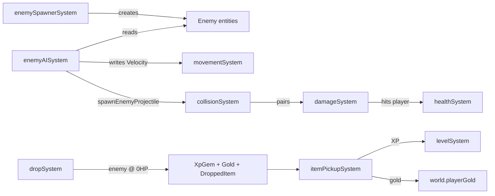
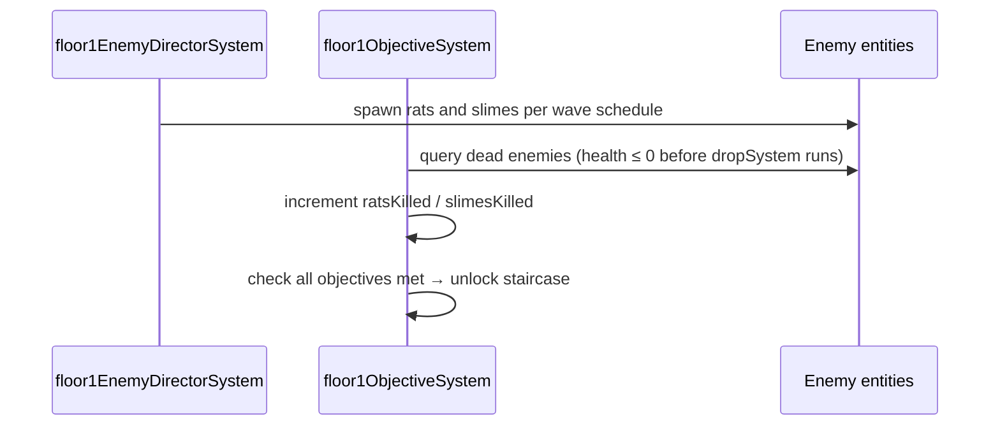

# Enemy AI & Spawner Systems

**Status:** ✅ Implemented  
**Layer:** `src/game/`  
**Labs:** `enemy-ai-lab`

---

## Systems in this group

| System               | File                                      | Pipeline position                               |
| -------------------- | ----------------------------------------- | ----------------------------------------------- |
| `enemyAISystem`      | `src/game/enemyAISystem.ts`               | preSystems                                      |
| `enemySpawnerSystem` | `src/game/enemySpawnerSystem.ts`          | preSystems                                      |
| `spawnerArenaSystem` | `src/game/spawners/spawnerArenaSystem.ts` | preSystems (immediately BEFORE `spawnerSystem`) |
| `spawnerSystem`      | `src/game/spawners/spawnerSystem.ts`      | preSystems                                      |

> **Spawner Battle Arena.** The `spawnerArenaSystem` runs immediately before `spawnerSystem` and turns each spawner mob into a mini-boss encounter: entering the spawn zone locks the containing room's doors (or raises an impassable tile-flag fence when the room isn't sealable), banks up to 10 child-XP drops onto the spawner, and grants them as a single XP gem when the spawner dies. Start/end fire dedicated VFX events and push HUD announcements onto `world.announcements`. See [ADR 0044](../knowledge/adr/0044-spawner-battle-arena.md) and [`.specify/specs/spawner-battle-arena.md`](../../.specify/specs/spawner-battle-arena.md).
>
> **BT AI arena lock-in priority.** When the player is physically trapped inside a spawner arena (fence raised or doors locked) or a Floor-1 boss room, the BT AI's Track A selector inserts a new priority slot — **1.5, between Retreat and Interact** — that pins the objective (spawner or boss) as the current target so the AI can't wander into progression/explore behaviors it will never satisfy until the cage lowers. While lock-in is active, retreat intentionally yields so the AI runs defensive engagement (boss/add pressure + spacing) instead of endless retreat loops inside a sealed arena. Detector: `src/game/ai/arena-lockin.ts` (pure). Rationale + acceptance metric: [ADR 0045](../knowledge/adr/0045-ai-arena-lockin-priority.md).

---

## enemyAISystem

### What it does

Each step, for every `Enemy + EnemyBehavior` entity:

1. **Aggro check** — enemy enters combat state when player enters `aggroRange` or is hit (permanent aggro flag).
2. **AI persona dispatch** — runs one of three behaviours:
   - `CHASE` — A\* pathfinding, follow waypoints toward player.
   - `SWARM` — flocking (separation + cohesion + player attraction vectors).
   - `RANGED` — maintains flanking distance, pathfinds to flank position, fires projectile when `attackRange` reached.
3. **Stuck detection** — if velocity has been zero for `STUCK_FRAMES_THRESHOLD` frames, forces a path refresh.
4. **Shooting** — ranged enemies call `spawnEnemyProjectile` when in range and cooldown elapsed.

### Contract

```
Reads:   EnemyBehavior.{type, speed, aggroRange, attackRange, fireCooldownMs,
                        lastFireMs, persona, traversalMode, flankDistance,
                        pathRefreshFrames, aggroedPermanently, stuckFrames}
         Position.x/y (enemy + player)
         DoorState (pathfinding avoids closed doors)
         FloorMap (tile passability for A*)
         world.elapsedMs, world.rng
Writes:  Velocity.x/y (enemy movement direction × speed)
         enemyBehavior.lastFireMs, aggroedPermanently, stuckFrames
         spawnEnemyProjectile (ranged enemies)
Side effects: path cache stored in WeakMap per world
```

### AI type dispatch



---

### CHASE persona (pathfinding)

```mermaid
flowchart TD
    CACHE{Path cache\nvalid & fresh?}
    FIND[findTilePath\nA* from enemy tile to player tile]
    NEXT[Pop next waypoint]
    STALE{Waypoint reached\nor path stale?}
    VEL[velocity = normalise(waypoint - pos) × speed]
    STUCK{stuckFrames >\nthreshold?}
    REFRESH[Force path refresh]

    CACHE -- yes --> NEXT
    CACHE -- no --> FIND
    FIND --> NEXT
    NEXT --> VEL
    VEL --> STALE
    STALE -- yes --> FIND
    STALE -- no --> STUCK
    STUCK -- yes --> REFRESH
    REFRESH --> FIND
```

### SWARM persona (flocking)



### RANGED persona



---

### PATH_PERSONA values

| Constant              | Value | Effect                           |
| --------------------- | ----- | -------------------------------- |
| `PATH_PERSONA.DIRECT` | 0     | Straight A\* to player           |
| `PATH_PERSONA.PATROL` | 1     | Patrol waypoints, aggro on sight |
| `PATH_PERSONA.AMBUSH` | 2     | Wait in room until player close  |

### TRAVERSAL_MODE values

| Constant                 | Value | Effect                                       |
| ------------------------ | ----- | -------------------------------------------- |
| `TRAVERSAL_MODE.GROUND`  | 0     | Standard tile pathfinding (doors block)      |
| `TRAVERSAL_MODE.FLYING`  | 1     | Ignores tile passability; straight-line move |
| `TRAVERSAL_MODE.PHASING` | 2     | Walks through walls (planned — not yet used) |

---

## enemySpawnerSystem

### What it does

Time-based enemy spawner. Every `spawnIntervalMs` it picks a random position inside the spawn bounds that:

1. Is not occupied by another enemy (overlap check).
2. Is not too close to the player.

Then calls `spawnEnemy` (from `src/core/helpers.ts`) and returns.

### Contract

```
Reads:   SpawnerConfig.{maxEnemies, spawnIntervalMs, enemyHp, enemySpeed}
         SpawnerBounds.{width, height}
         world.elapsedMs, world.rng
         Enemy query count (max cap)
         Player position (min spawn distance)
Writes:  SpawnerState.lastSpawnMs
         Spawns Enemy entities with Health + EnemyBehavior + Position + Velocity + Sprite
Side effects: new enemy entities in ECS
```

### Diagram

```mermaid
flowchart TD
    TICK{elapsedMs - lastSpawnMs\n≥ spawnIntervalMs?}
    CAP{enemy count\n< maxEnemies?}
    POS[Pick random position\nwithin bounds]
    OVERLAP{overlaps existing\nenemy?}
    PROX{too close\nto player?}
    SPAWN[spawnEnemy]
    UPDATE[lastSpawnMs = elapsedMs]
    RETRY[try new random pos\n(up to N attempts)]

    TICK -- no --> DONE[skip]
    TICK -- yes --> CAP
    CAP -- no --> DONE
    CAP -- yes --> POS
    POS --> OVERLAP
    OVERLAP -- yes --> RETRY
    OVERLAP -- no --> PROX
    PROX -- yes --> RETRY
    PROX -- no --> SPAWN
    SPAWN --> UPDATE
```

---

## Relationships to other systems



---

## Floor 1 enemy director system

The Floor 1 definition (`src/game/scenarioDefinitions.ts`) registers
`floor1EnemyDirectorSystem` in the scenario's `afterSpawnerSystems` slot. The
canonical bootstrap inserts it into `preSystems` immediately after
`spawnerSystem`. It manages a wave schedule, spawning `rat` and `slime` enemy
species per the Floor 1 objective targets. It replaces `enemySpawnerSystem` for
Floor 1 to give precise control over enemy mix and pacing.


