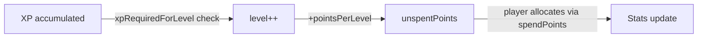
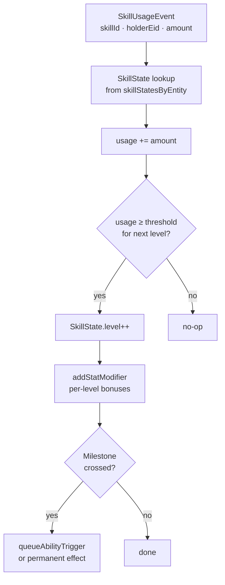

# Progression Systems

**Status:** ✅ Implemented (equipment stat bonuses 🚧 partial)  
**Layer:** `src/game/systems/` + `src/core/systems/equipmentSystem.ts`  
**Labs:** `xp-curve-lab`, `stat-lab`, `stats-lab`, `skill-lab`, `equipment-lab`

---

## Systems in this group

| System            | File                                  | Pipeline position |
| ----------------- | ------------------------------------- | ----------------- |
| `levelSystem`     | `src/game/systems/levelSystem.ts`     | postSystems       |
| `statsSystem`     | `src/game/systems/statsSystem.ts`     | postSystems       |
| `skillSystem`     | `src/game/systems/skillSystem.ts`     | postSystems       |
| `abilitySystem`   | `src/game/systems/abilitySystem.ts`   | postSystems       |
| `equipmentSystem` | `src/core/systems/equipmentSystem.ts` | postSystems       |

---

## Data model overview

```mermaid
graph TD
    subgraph world["GameWorld (world-level singletons)"]
        PL[playerLevel\nxp · level · unspentPoints]
        SM[statModifiers[]\nsourceType · stat · op · value · expiresFrame]
        PS[playerSkills\nMap<skillId, SkillState>]
        PA[abilityStatesByEntity\nMap<eid, AbilityState>]
        SUE[skillUsageEvents[]\ncleared per frame]
        ATE[abilityTriggerEvents[]\ncleared per frame]
        SD[statsDirty flag]
    end

    subgraph stores["ComponentStores (per-entity)"]
        BS[BaseStats\nprimary stats array]
        ES[EffectiveStats\ncomputed stats]
        ST[Stats\nfinal gameplay values]
        SP[StatPoints\nspent allocation]
    end

    PL -->|level-up grants unspentPoints| SD
    SM -->|filtered by expiresFrame| SD
    SP -->|spend via spendPoints| SD
    SD -->|true → statsSystem reruns| ST
```

---

## levelSystem

### What it does

Each step, accumulates XP in `world.playerLevel.xp` (XP is added elsewhere, typically by `itemPickupSystem`). Advances `playerLevel.level` as far as `xpRequiredForLevel(n)` allows, granting `pointsPerLevel` unspent stat points per level. Sets `world.statsDirty = true` and transitions to `level_up` state so the UI can show an allocation screen.

### Allocation UX

The visual game surfaces the earned points through the **level-up overlay**
(`src/engine/LevelUpUI.ts`, sandboxed in `level-up-lab`). When
`world.state === 'level_up'` and the player has unspent points, `MainGameScene`
freezes the simulation and opens the overlay, where the player distributes
points across the gameplay stats (−/+ per row or keyboard), previews the
resulting values, and confirms. Confirming calls `spendPoints` (injected via the
scene's `allocateStatPoints` option) and resumes play; leftover points are banked
toward the next level. All clamp/navigation rules live in the pure, unit-tested
`src/shared/level-up-allocation.ts` module, with display labels/formatting in
`src/shared/stat-display.ts`. The headless runner has no UI and instead automates
allocation via `auto-progression.ts`.

### Contract

```
Reads:   world.playerLevel.{xp, level}
         xpRequiredForLevel(n) — quadratic XP curve from xpMath.ts
Writes:  world.playerLevel.{level, unspentPoints}
         world.statsDirty = true
         world.state = 'level_up' (when leveled)
Side effects: none beyond state mutation
```

### XP curve



XP required formula: `BASE_PER_LEVEL × level ^ SCALING_FACTOR` (tuned in `shared/data/tuning.json`).

---

## statsSystem

### What it does

Recomputes final `Stats` component values from three inputs:

1. **Base values** — `STAT_BASE[stat]` constants.
2. **Allocated points** — `statPoints[stat] × STAT_POINT_INCREMENT[stat]`.
3. **Active modifiers** — `StatModifier[]` filtered for `expiresFrame` (expired ones are pruned).

Formula per stat:

```
raw   = base[stat] + (points[stat] × increment[stat]) + Σ(add modifiers)
final = clamp(STAT_MIN[stat], raw) × (1 + Σ(multiply modifier values))
```

Only runs when `world.statsDirty = true`, then clears the flag.

### Contract

```
Reads:   world.statsDirty, world.statModifiers, world.frameCount
         ComponentStores.statPoints (per player entity)
Writes:  ComponentStores.stats (final gameplay values per entity)
         world.statModifiers (prunes expired)
         world.statsDirty = false
Side effects: none
```

### Stat pipeline

```mermaid
flowchart LR
    BASE[STAT_BASE\nconstants]
    PTS[statPoints × increment]
    MODS[active StatModifiers\n'add' ops summed]
    RAW[raw = BASE + PTS + add_mods]
    CLAMP[clamp to STAT_MIN]
    MULT[× (1 + sum of multiply mods)]
    FINAL[Stats component\n(gameplay-facing values)]

    BASE --> RAW
    PTS --> RAW
    MODS --> RAW
    RAW --> CLAMP
    CLAMP --> MULT
    MULT --> FINAL
```

### Stats exposed to gameplay

| Stat key          | Used by                          |
| ----------------- | -------------------------------- |
| `maxHp`           | healthSystem HP cap              |
| `moveSpeed`       | playerInputSystem velocity       |
| `damage`          | weaponSystem damage bonus        |
| `armor`           | applyDamage reduction            |
| `attackSpeed`     | weaponSystem cooldown multiplier |
| `pickupRange`     | itemPickupSystem radius          |
| `projectileCount` | weaponSystem multi-shot          |
| `projectileSpeed` | weaponSystem projectile velocity |

---

## skillSystem

### What it does

Consumes `world.skillUsageEvents` each frame. For each event:

1. Finds the `SkillState` for the holder entity.
2. Increments cumulative usage.
3. If usage crosses a level threshold, increments `SkillState.level` and applies per-level `StatModifier`s.
4. Fires any one-time milestone effects when thresholds are crossed.
5. Clears `skillUsageEvents` at end of frame.

### Contract

```
Reads:   world.skillUsageEvents[]
         SkillDefinition from registry (thresholds, bonuses)
         world.skillStatesByEntity (or world.playerSkills for v1 fallback)
Writes:  SkillState.{level, usage, triggeredMilestones}
         world.statModifiers (new per-level bonuses)
         world.abilityTriggerEvents (milestone → ability trigger)
         world.skillUsageEvents.length = 0 (cleared)
Side effects: addStatModifier, queueAbilityTrigger
```

### Skill level-up flow



### Skill caps

| Cap                 | Value | Behaviour                       |
| ------------------- | ----- | ------------------------------- |
| `SKILL_NATURAL_CAP` | 15    | Regular usage can reach this    |
| `SKILL_HARD_CAP`    | 20    | Requires special catalyst items |

---

## abilitySystem

### What it does

Manages two ability slots per entity:

- **Active abilities** — up to `ACTIVE_ABILITY_SLOT_LIMIT` equipped; each has a cooldown. Triggered by `AbilityTriggerCondition` events in `world.abilityTriggerEvents`.
- **Passive abilities** — applied once on equip, removed on unequip via `StatModifier`s.

Each step: processes `abilityTriggerEvents`, checks conditions, resolves effects via `applyCatalogEffect`, clears the event list.

### Contract

```
Reads:   world.abilityTriggerEvents[]
         AbilityDefinition from registry (conditions, effects, cooldown)
         world.abilityStatesByEntity (cooldowns, equipped ids)
Writes:  AbilityState.cooldownByAbilityId (sets cooldown after fire)
         applyCatalogEffect → StatModifier or world-state mutation
         world.abilityTriggerEvents.length = 0
```

### Ability resolution

```mermaid
flowchart TD
    TRIGGER[AbilityTriggerEvent\nabilityId · holderEid · condition]
    STATE[AbilityState lookup]
    COOL{Cooldown\nexhausted?}
    DEF[AbilityDefinition lookup\nfrom registry]
    MATCH{Condition matches\ntrigger?}
    APPLY[applyCatalogEffect\nfor each effect in def]
    SET_CD[cooldownByAbilityId.set\n(startFrame + cooldown)]
    SKIP[skip — still on cooldown]

    TRIGGER --> STATE
    STATE --> COOL
    COOL -- no --> SKIP
    COOL -- yes --> DEF
    DEF --> MATCH
    MATCH -- no --> SKIP
    MATCH -- yes --> APPLY
    APPLY --> SET_CD
```

---

## equipmentSystem (🚧 Partial)

### What it does

Manages the six equipment slots (`head`, `body`, `legs`, `gloves`, `weapon`, `offhand`). Equipping/unequipping an item applies or removes its `StatModifier`s via `addStatModifier`/`removeStatModifiers`. The slot management and UI wiring exist, but automatic stat application from item definitions is not yet fully connected.

### Contract (intended)

```
Reads:   Equipment slots per entity, ItemDef stat bonuses
Writes:  world.statModifiers (add on equip, remove on unequip)
         world.statsDirty = true
```

---

## Relationships to other systems

```mermaid
graph TD
    PKP[itemPickupSystem\nXP gems → world.playerLevel.xp] --> LEVEL[levelSystem]
    LEVEL -->|level++| STATS_DIRTY[statsDirty = true]
    SPEND[spendPoints\nUI allocates unspentPoints] --> STATS_DIRTY
    SKILLS[skillSystem\nusage events → modifiers] --> SM[statModifiers[]]
    ABILS[abilitySystem\ntrigger events → effects] --> SM
    EQUIP[equipmentSystem\nequip/unequip] --> SM
    SM --> STATS_DIRTY
    STATS_DIRTY --> STATSSYS[statsSystem recomputes Stats]
    STATSSYS -->|Stats.moveSpeed| MOV[movementSystem]
    STATSSYS -->|Stats.damage| WS[weaponSystem]
    STATSSYS -->|Stats.armor| DAM[applyDamage]
    STATSSYS -->|Stats.pickupRange| PKP2[itemPickupSystem]
```
