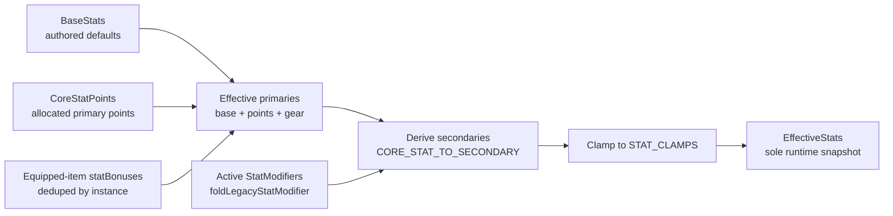
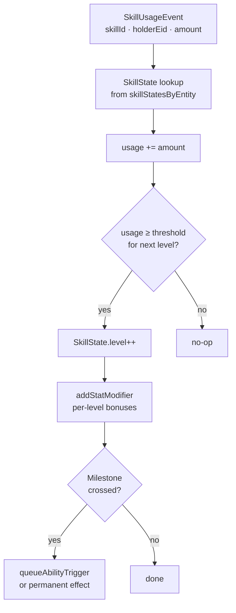
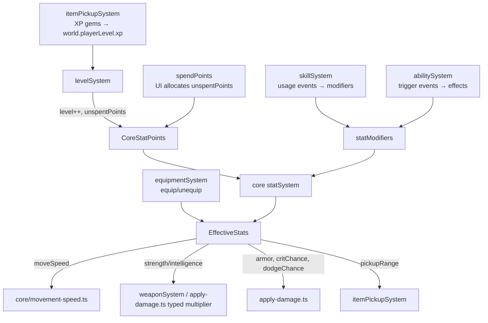

# Progression Systems

**Status:** ✅ Implemented
**Layer:** `src/game/systems/` + `src/core/systems/statSystem.ts` + `src/core/systems/equipmentSystem.ts`
**Labs:** `xp-curve-lab`, `stat-lab`, `stats-lab`, `skill-lab`, `equipment-lab`, `level-up-lab`

> Reconciled to the
> [primary-stat system overhaul](../knowledge/adr/2026-07-16-primary-stat-system-overhaul.md):
> `EffectiveStats` is the SOLE runtime stat snapshot (the older computed `Stats`
> component and its game-layer `statsSystem` are deleted); there is no
> `statsDirty` flag — the core `statSystem` always recomputes every frame.
> Mana/MP does not exist — ability access is unlock + cooldown gated only. See
> `.specify/specs/stats-skills-levels.md` for the full contract.

---

## Systems in this group

| System            | File                                  | Pipeline position                                      |
| ----------------- | ------------------------------------- | ------------------------------------------------------ |
| `levelSystem`     | `src/game/systems/levelSystem.ts`     | postSystems                                            |
| `statSystem`      | `src/core/systems/statSystem.ts`      | preSystems                                             |
| `skillSystem`     | `src/game/systems/skillSystem.ts`     | postSystems                                            |
| `abilitySystem`   | `src/game/systems/abilitySystem.ts`   | postSystems                                            |
| `equipmentSystem` | `src/core/systems/equipmentSystem.ts` | (event-driven — equip/unequip, not a per-frame system) |

`src/game/systems/statsSystem.ts` still exists but is **not** a `(world) =>
void` system — it exports only the allocation APIs `spendPoints`,
`addStatModifier`, `removeStatModifiers`, which write to
`world.stores.coreStatPoints` / `world.statModifiers` for the core
`statSystem` to fold in on its next tick.

---

## Data model overview

```mermaid
graph TD
    subgraph world["GameWorld (world-level singletons)"]
        PL[playerLevel\nxp · level · unspentPoints]
        SM[statModifiers[]\nsourceType · stat · op · value · expiresFrame]
        PS[playerSkills\nMap<skillId, SkillState>]
        PA[abilityStatesByEntity\nMap<eid, AbilityState>]
        SUE[skillUsageEvents[]\ncleared per frame]
        ATE[abilityTriggerEvents[]\ncleared per frame]
    end

    subgraph stores["ComponentStores (per-entity)"]
        BS[BaseStats\nauthored base primary+secondary values]
        CSP[CoreStatPoints\nallocated per-primary points]
        ES[EffectiveStats\nSOLE runtime snapshot — base + points + gear + modifiers]
        DM[DamageMeta\nfail-closed origin/affinity/scale/crit tags]
    end

    PL -->|level-up grants unspentPoints| CSP
    CSP -->|spendPoints| ES
    SM -->|foldLegacyStatModifier, filtered by expiresFrame| ES
    BS --> ES
    ES -->|statSystem runs every frame, no dirty flag| ES
```

---

## levelSystem

### What it does

Each step, accumulates XP in `world.playerLevel.xp` (XP is added elsewhere, typically by `itemPickupSystem`). Advances `playerLevel.level` as far as `xpRequiredForLevel(n)` allows, granting `pointsPerLevel` unspent stat points per level. Transitions to `level_up` state so the UI can show an allocation screen.

### Allocation UX

The visual game surfaces the earned points through the **level-up overlay**
(`src/engine/LevelUpUI.ts`, sandboxed in `level-up-lab`). When
`world.state === 'level_up'` and the player has unspent points, `MainGameScene`
freezes the simulation and opens the overlay, where the player distributes
points across the seven primary stats (Charisma excluded — non-allocatable)
(−/+ per row or keyboard), previews the resulting values, and confirms.
Confirming calls `spendPoints` (injected via the scene's `allocateStatPoints`
option) and resumes play; leftover points are banked toward the next level. All
clamp/navigation rules live in the pure, unit-tested
`src/shared/level-up-allocation.ts` module, with display labels/formatting in
`src/shared/stat-display.ts`. The headless runner has no UI and instead automates
allocation via `auto-progression.ts` (see the default AI allocator sequence in
`.specify/specs/stats-skills-levels.md`).

### Contract

```
Reads:   world.playerLevel.{xp, level}
         xpRequiredForLevel(n) — quadratic XP curve from xpMath.ts
Writes:  world.playerLevel.{level, unspentPoints}
         world.state = 'level_up' (when leveled)
Side effects: none beyond state mutation
```

### XP curve


XP required formula: `BASE_PER_LEVEL × level ^ SCALING_FACTOR` (tuned in `shared/data/tuning.json`).

---

## statSystem (core) — the sole EffectiveStats recompute

### What it does

`src/core/systems/statSystem.ts` is the ONLY per-frame stat recompute — there
is no dirty-flag gating, it always runs for every `[Equipment, BaseStats,
EffectiveStats]` entity (in practice only the player). Each tick:

1. **Prunes expired modifiers** — filters `world.statModifiers` for
   `expiresFrame <= world.frameCount`.
2. **Derives EffectiveStats** via the single pure formula
   (`computeEffectiveStatsFromLoadout`, `src/core/effective-stats.ts`):
   base → fold `CoreStatPoints` into their typed primary field → fold
   equipped-item `statBonuses` (deduped by instance) → fold active
   `StatModifier`s (`foldLegacyStatModifier`) → derive secondaries from the
   now-complete effective primaries (`CORE_STAT_TO_SECONDARY`) → clamp.
3. **Syncs Health by delta** — captures `prevMaxHp` before recompute, then
   applies `Health.max/current += (newMaxHp - prevMaxHp)` so a Constitution
   change heals/damages by exactly the delta (never resets current HP to
   full, never lets repeated ticks creep max HP).

Strength and Intelligence do **not** derive a generic secondary — their
payoff is a typed-primary multiplier (`computeTypedPrimaryMultiplier`)
applied directly at damage/spell resolution, keeping physical and magical
offense independent.

### Contract

```
Reads:   world.statModifiers, world.frameCount
         ComponentStores.baseStats, .coreStatPoints (per entity)
         Equipment side-map state (per entity)
Writes:  ComponentStores.effectiveStats (the sole runtime stat snapshot)
         world.statModifiers (prunes expired)
         Health.max/current (delta-synced to effectiveStats.maxHp)
Side effects: none
```

### Stat pipeline



### EffectiveStats fields used by gameplay

| Field                                               | Used by                                                                |
| --------------------------------------------------- | ---------------------------------------------------------------------- |
| `maxHp`                                             | `statSystem`'s own Health-delta sync                                   |
| `moveSpeed`                                         | `core/movement-speed.ts#computeMoveSpeed` (before status/encumbrance)  |
| `damageBonus`/`damagePercent`                       | `apply-damage.ts` generic offense step (player→enemy only)             |
| `strength`/`intelligence`                           | `computeTypedPrimaryMultiplier` (physical/magic damage, spell outputs) |
| `armor`                                             | `apply-damage.ts` incoming-damage reduction                            |
| `attackSpeed`/`cooldownReduction`                   | `applyAttackSpeedAndCooldownReduction` (weapon cadence)                |
| `critChance`/`critMultiplier`/`dodgeChance`         | `apply-damage.ts` crit/dodge rolls                                     |
| `accuracy`                                          | `weaponSystem.computeEffectiveAccuracy`                                |
| `pickupRange`, `projectileSpeed`, `projectileCount` | Inert snapshot fields (no current consumer)                            |

---

## skillSystem

### What it does

Consumes `world.skillUsageEvents` each frame. For each event:

1. Finds the `SkillState` for the holder entity.
2. Increments cumulative usage.
3. If usage crosses a level threshold, increments `SkillState.level` and applies per-level `StatModifier`s (which fold into `EffectiveStats` on the next `statSystem` tick).
4. Fires any one-time milestone effects when thresholds are crossed.
5. Clears `skillUsageEvents` at end of frame.

### Contract

```
Reads:   world.skillUsageEvents[]
         SkillDefinition from registry (thresholds, bonuses)
         world.skillStatesByEntity (or world.playerSkills for v1 fallback)
Writes:  SkillState.{level, usage, triggeredMilestones}
         world.statModifiers (new per-level bonuses)
         world.abilityTriggerEvents (milestone → ability trigger)
         world.skillUsageEvents.length = 0 (cleared)
Side effects: addStatModifier, queueAbilityTrigger
```

### Skill level-up flow



### Skill caps

| Cap                 | Value | Behaviour                       |
| ------------------- | ----- | ------------------------------- |
| `SKILL_NATURAL_CAP` | 15    | Regular usage can reach this    |
| `SKILL_HARD_CAP`    | 20    | Requires special catalyst items |

---

## abilitySystem

### What it does

Manages two ability slots per entity:

- **Active abilities** — up to `ACTIVE_ABILITY_SLOT_LIMIT` equipped; each has a cooldown. Triggered by `AbilityTriggerCondition` events in `world.abilityTriggerEvents`.
- **Passive abilities** — applied once on equip, removed on unequip via `StatModifier`s.

Each step: processes `abilityTriggerEvents`, checks conditions, resolves effects via `applyCatalogEffect`, clears the event list. Ability access is gated by unlock progression (`world.featureUnlocks.spells`) and cooldown only — **there is no mana/MP cost or resource pool.**

### Contract

```
Reads:   world.abilityTriggerEvents[]
         AbilityDefinition from registry (conditions, effects, cooldown)
         world.abilityStatesByEntity (cooldowns, equipped ids)
Writes:  AbilityState.cooldownByAbilityId (sets cooldown after fire)
         applyCatalogEffect → StatModifier, EffectiveStats-scaled damage/heal, or world-state mutation
         world.abilityTriggerEvents.length = 0
```

Every spell's numeric outputs (damage, healing, duration, radius, etc.) are
authored inline as `{ base, scalesWithIntelligence }` and resolved through
`resolveScalableOutput(Rounded)` against the caster's effective Intelligence —
see `.specify/specs/stats-skills-levels.md` for the full formula and the
magic-weapon/spell scaling-parity guarantee.

### Ability resolution

```mermaid
flowchart TD
    TRIGGER[AbilityTriggerEvent\nabilityId · holderEid · condition]
    STATE[AbilityState lookup]
    COOL{Cooldown\nexhausted?}
    DEF[AbilityDefinition lookup\nfrom registry]
    MATCH{Condition matches\ntrigger?}
    APPLY[applyCatalogEffect\nfor each effect in def]
    SET_CD[cooldownByAbilityId.set\n(startFrame + cooldown)]
    SKIP[skip — still on cooldown]

    TRIGGER --> STATE
    STATE --> COOL
    COOL -- no --> SKIP
    COOL -- yes --> DEF
    DEF --> MATCH
    MATCH -- no --> SKIP
    MATCH -- yes --> APPLY
    APPLY --> SET_CD
```

---

## equipmentSystem

### What it does

Manages the full paper-doll slot set (`src/shared/equipment-slots.ts`).
Equipping/unequipping an item recomputes `EffectiveStats` directly through
`computeEffectiveStatsFromLoadout` (not via `StatModifier`s) — equipped-item
`statBonuses` are one of that formula's direct inputs, deduped by equipment
instance so a multi-slot item's bonuses (and `weightLb`) count once. Every
`EquipmentItemDef` also carries a required `weightLb` (currently `0` on every
shipped item), feeding the encumbrance system
(`src/core/encumbrance.ts`) that `EquipmentUI` displays alongside stats.

### Contract

```
Reads:   Equipment slots per entity, EquipmentItemDef.statBonuses/weightLb
Writes:  Equipment side-map state (equip/unequip)
         EffectiveStats (recomputed immediately via computeEffectiveStatsFromLoadout)
```

---

## Relationships to other systems


