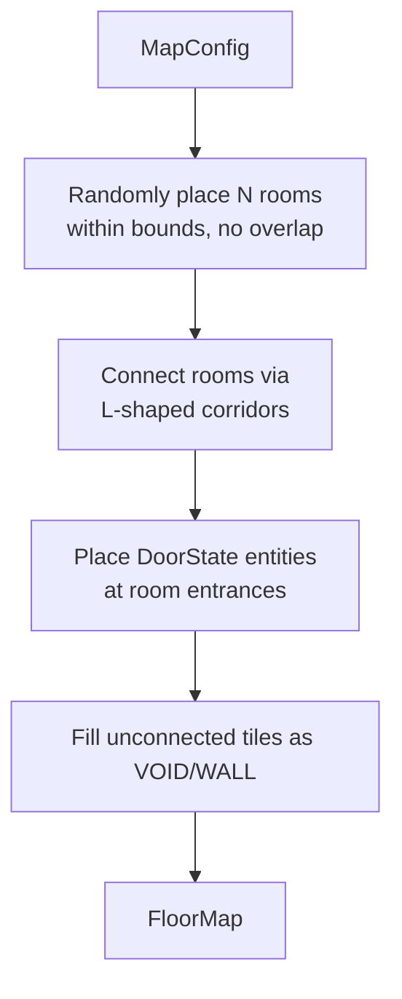
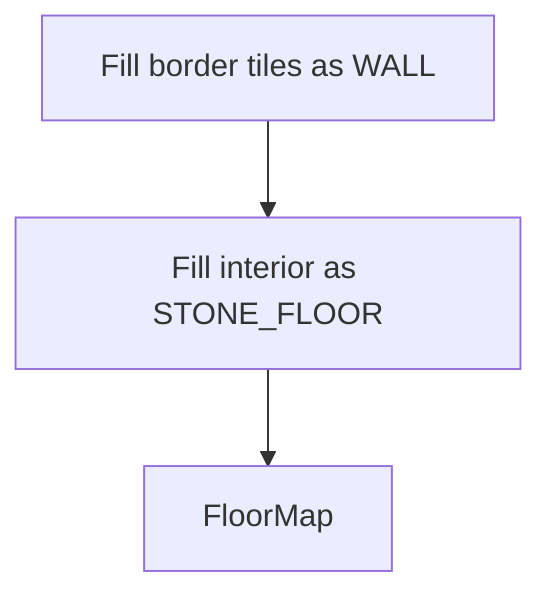
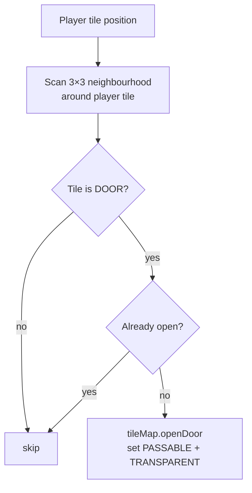
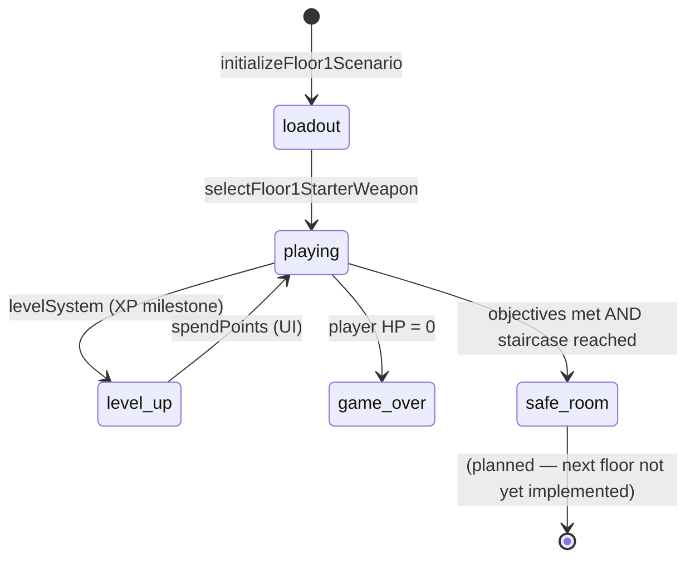

# Map Generation & Floor Systems

**Status:** ✅ Implemented  
**Layer:** `src/core/map/` + `src/game/floor1Scenario.ts`  
**Labs:** `map-gen-lab`, `pathfinding-lab`, `fov-lab`, `door-lab`, `floor1-lab`

---

## Systems in this group

| System / Module    | File                                          | Role                                     |
| ------------------ | --------------------------------------------- | ---------------------------------------- |
| `DungeonGenerator` | `src/core/map/generators/DungeonGenerator.ts` | Room-and-corridor map                    |
| `CaveGenerator`    | `src/core/map/generators/CaveGenerator.ts`    | Cellular-automata cave                   |
| `ArenaGenerator`   | `src/core/map/generators/ArenaGenerator.ts`   | Open flat arena                          |
| `FloorMap`         | `src/core/map/FloorMap.ts`                    | World-attached map object                |
| `TileMap`          | `src/core/map/TileMap.ts`                     | Tile flags (PASSABLE, TRANSPARENT, DOOR) |
| `RoomGraph`        | `src/core/map/RoomGraph.ts`                   | Room semantic metadata                   |
| `pathfinding`      | `src/core/map/pathfinding.ts`                 | A\* tile pathfinding                     |
| `doorSystem`       | `src/core/systems/doorSystem.ts`              | Auto-open doors near player              |
| `fovSystem`        | `src/core/systems/fovSystem.ts`               | Recursive shadowcasting FOV              |
| `floor1Scenario`   | `src/game/floor1Scenario.ts`                  | Floor 1 tutorial logic                   |

---

## Map data model

```mermaid
graph TD
    subgraph FloorMap
        TM[TileMap\nUint8 flags[]\nPASSABLE · TRANSPARENT · DOOR]
        RG[RoomGraph\nRoom[] with rect bounds · type · connections]
        TERRAIN[terrain: Uint8Array\nTerrainType per tile — visual only]
        VISIBLE[visible: Uint8Array\nFOV output — 1 = currently lit]
        SPAWN[playerSpawn: {x, y}]
    end

    FloorMap --> WORLD[world.floorMap]
    TM -->|lightPasses callback| FOV[fovSystem]
    TM -->|isPassableAt| MOV[movementSystem]
    TM -->|isDoor / openDoor| DOOR[doorSystem]
    RG -->|room rects| SPAWN2[enemy spawn placement]
    TERRAIN -->|color lookup| RENDER[PhaserBridge terrain draw]
    VISIBLE -->|fog-of-war| BRIDGE[PhaserBridge entity alpha]
```

---

## Map generators

### Generator interface

```typescript
interface MapGenerator {
  readonly name: string;
  generate(config: MapConfig, rng: SeededRandom): FloorMap;
}
```

All three generators produce a `FloorMap` from a `MapConfig` (width, height, tile size, biome, seed).

### DungeonGenerator

BSP-style room placement with corridor connections. Used for `DUNGEON` and `CASTLE` biomes.



### CaveGenerator

Cellular automata — used for `CAVE` and `FIRE_SWAMP` biomes.

```mermaid
flowchart TD
    SEED[Random fill at initialFill density]
    SMOOTH[N smoothing passes:\nbirth rule: dead cell → alive if live neighbors ≥ born[]\nsurvive rule: live cell stays if live neighbors ∈ survive[]]
    FLOOD[Flood-fill largest connected region]
    WALLS[Remaining cells → WALL]
    RESULT[FloorMap]

    SEED --> SMOOTH --> FLOOD --> WALLS --> RESULT
```

### ArenaGenerator

Flat open room. Used for `ARENA`, `OPEN_WORLD`, and `TOWN` (placeholder) biomes.



### Registered biomes

| BiomeType                     | Generator                               |
| ----------------------------- | --------------------------------------- |
| `DUNGEON`, `CASTLE`           | `DungeonGenerator`                      |
| `CAVE`, `FIRE_SWAMP`          | `CaveGenerator`                         |
| `ARENA`, `OPEN_WORLD`, `TOWN` | `ArenaGenerator`                        |
| `FOREST`                      | `CaveGenerator` (low fill, high smooth) |

---

## fovSystem

### What it does

Each step, computes the player's visible tile set using **rot-js RecursiveShadowcasting**. Clears `floorMap.visible`, runs `fov.compute(tileX, tileY, radius, callback)` where the callback marks `visible[idx] = 1`. PhaserBridge reads `visible` to dim/hide sprites in unseen tiles.

### Contract

```
Reads:   Player + Position (player tile position)
         floorMap.tileMap.createLightPassesCallback() (TRANSPARENT tile flag)
Writes:  floorMap.visible[idx] = 1 for visible tiles
         floorMap.clearVisibility() first (all tiles → 0)
Side effects: none (rendering reads visible[] directly)
```

### Diagram

```mermaid
flowchart TD
    PLAYER[Player tile position\n= floor(px/tileSize)]
    CLEAR[floorMap.clearVisibility\nall visible[] = 0]
    PASSES[lightPasses(tx, ty)\n= TRANSPARENT flag set?]
    FOV[RecursiveShadowcasting.compute\nradius = 25 tiles]
    MARK[For each visible tile:\nvisible[ty * width + tx] = 1]
    BRIDGE[PhaserBridge reads visible[]\nentity alpha = 0.3 if invisible]

    PLAYER --> CLEAR
    CLEAR --> FOV
    PASSES --> FOV
    FOV --> MARK
    MARK --> BRIDGE
```

---

## doorSystem

### What it does

Automatically opens `DOOR` tiles within 1 tile of the player, making them `PASSABLE + TRANSPARENT`. This triggers a FOV update on the next frame, revealing the room beyond. Also syncs any `DoorState` component entities that have `isOpen` changed externally.

### Contract

```
Reads:   Player + Position (tile coords)
         floorMap.tileMap.isDoor / isPassable / openDoor
Writes:  floorMap.tileMap tile flags (opens door tiles near player)
         DoorState.isOpen synced to tile flags
Side effects: tile flags mutation triggers FOV change on next fovSystem run
Must run BEFORE fovSystem each step.
```

### Diagram



---

## Pathfinding (A\*)

Used by `enemyAISystem` for navigating the tile map. Finds the shortest walkable path between two tile positions.

### Contract

```
Inputs:  startTile: TilePoint, goalTile: TilePoint, world: GameWorld
         traversalMode: GROUND | FLYING
Returns: TilePoint[] (waypoints) or [] if no path
```

Flying enemies skip the tile passability check; ground enemies avoid walls and closed doors.

```mermaid
graph LR
    START[Start tile]
    GOAL[Goal tile]
    ASTAR[A* search\nheuristic = Manhattan distance]
    PASS{isPassable\n(GROUND mode)?}
    PATH[TilePoint[] path]

    START --> ASTAR
    GOAL --> ASTAR
    ASTAR --> PASS
    PASS -- yes --> PATH
    PASS -- no --> WALL[wall — skip neighbour]
```

---

## Floor 1 Scenario

`initializeFloor1Scenario(world)` is the bootstrap function called on scene creation. It:

1. Generates a `40×23` dungeon floor with a world-RNG-derived seed (`world.rng.nextInt(1, 2_000_000)`).
2. Spawns the player at `floorMap.playerSpawn`.
3. Sets `world.state = 'loadout'` and presents the starter weapon modal.
4. Injects three systems into `preSystems`/`postSystems`:

| System                      | Role                                                                  |
| --------------------------- | --------------------------------------------------------------------- |
| `floor1PlayerStatSystem`    | Applies `baseStatBonuses` (from protagonist definition) to the player |
| `floor1EnemyDirectorSystem` | Wave-based spawning of rats and slimes toward objective               |
| `floor1ObjectiveSystem`     | Tracks kills, gold, junk; unlocks staircase when done                 |

### Floor 1 objective state machine



### Floor 1 constants

| Constant                | Value                                     |
| ----------------------- | ----------------------------------------- |
| Required rats killed    | 6                                         |
| Required slimes killed  | 4                                         |
| Required gold collected | 15                                        |
| Required junk items     | 2                                         |
| Floor timer             | 300 s                                     |
| Starter weapon pool     | sword, knife, bow, pistol, throwing-knife |

---

## Relationships to other systems

```mermaid
graph LR
    GEN[Map generators] -->|produces| FM[FloorMap]
    FM -->|world.floorMap| MOV[movementSystem\ntile collision]
    FM --> DOOR[doorSystem]
    FM --> FOV[fovSystem]
    FM --> AI[enemyAISystem\nA* pathfinding]
    FM --> BRIDGE[PhaserBridge\nterrain draw · FOV alpha]
    DOOR -->|opens tile| FOV
    FOV -->|visible[]| BRIDGE
    F1[floor1Scenario] -->|generates| FM
    F1 -->|injects| DIR[floor1EnemyDirectorSystem]
    F1 -->|injects| OBJ[floor1ObjectiveSystem]
    DIR -->|spawns| ENE[Enemy entities]
    OBJ -->|tracks| KILLS[ratsKilled · slimesKilled · goldCollected]
    KILLS -->|all met| STAIR[staircase unlock]
```
