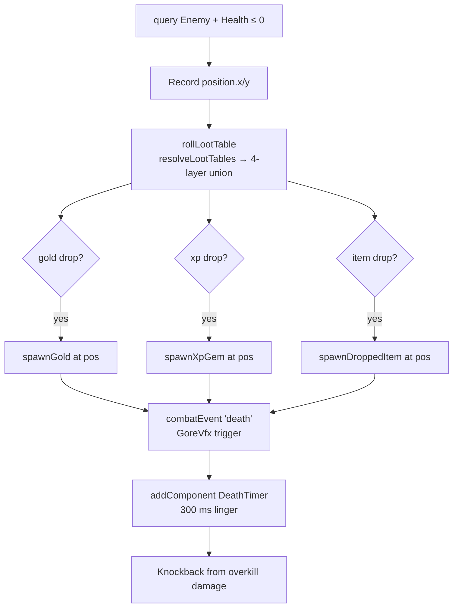
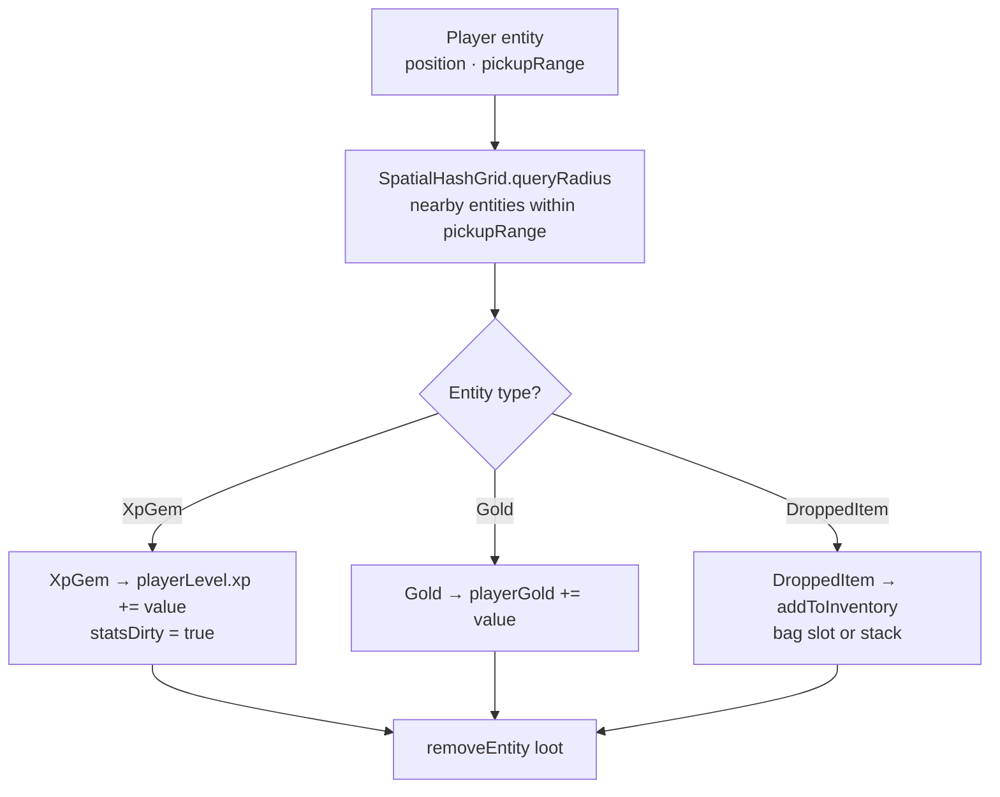
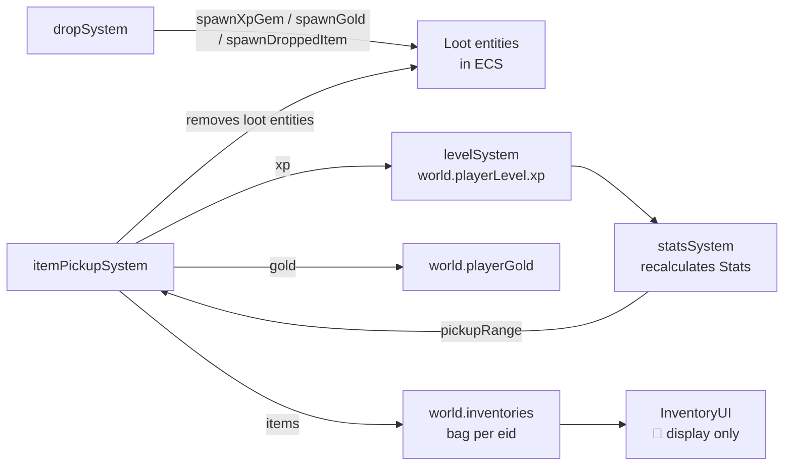

# Drops & Loot Systems

**Status:** ✅ Implemented (InventoryUI wiring 🚧 partial)  
**Layer:** `src/core/systems/` + `src/shared/`  
**Labs:** `drop-lab`, `itempickup-lab`, `inventory-lab`

---

## Systems in this group

| System             | File                                   | Pipeline position        |
| ------------------ | -------------------------------------- | ------------------------ |
| `dropSystem`       | `src/core/systems/dropSystem.ts`       | 14 (before healthSystem) |
| `itemPickupSystem` | `src/core/systems/itemPickupSystem.ts` | 13                       |

Supporting modules:

| Module           | File                        | Role                                           |
| ---------------- | --------------------------- | ---------------------------------------------- |
| `loot-tables.ts` | `src/shared/loot-tables.ts` | Data-driven drop config + roll logic           |
| `items.ts`       | `src/shared/items.ts`       | 100-item catalog, rarity, tags                 |
| `inventory.ts`   | `src/shared/inventory.ts`   | Bag data model + pure functions                |
| `InventoryUI`    | `src/engine/InventoryUI.ts` | Renders inventory bag (🚧 not yet interactive) |

---

## dropSystem

### What it does

Runs **before** `healthSystem` so enemy positions are still valid when entities die. Queries all `Enemy + Health` entities with `health.current ≤ 0`. For each dying enemy:

1. Records position.
2. Rolls the loot table (4-layer union: entity → type → area → global/floor).
3. Spawns `Gold`, `XpGem`, and/or `DroppedItem` entities at the death position.
4. Emits a `'death'` `CombatEvent` (consumed by `GoreVfx`).
5. Applies death knockback using the overkill damage scaled between `DEATH_KNOCKBACK_BASE` and `DEATH_KNOCKBACK_MAX`.
6. Adds a `DeathTimer` component so the entity lingers for `DEATH_LINGER_MS` (300 ms) before removal.

### Contract

```
Reads:   Enemy + Health.current ≤ 0 (enemies that just died)
         Position.x/y (death position)
         world.rng (loot table rolls)
         LootTable config (rollLootTable)
Writes:  spawnXpGem / spawnGold / spawnDroppedItem (new entities)
         addComponent DeathTimer on dying enemy
         world.combatEvents ('death' event pushed)
         Knockback component on dying enemy (if overkill > 0)
Side effects: new loot entities added to ECS
Must run BEFORE healthSystem (reads dying enemy positions).
```

### Diagram



---

## Loot table resolution (4-layer union)

```mermaid
graph TD
    E[Entity-level table\nunique named enemies]
    T[Type-level table\nenemy species / class]
    A[Area-level table\ncurrent map zone]
    G[Global / floor table\nalways-active entries]

    E --> MERGE[Merge all layers\ninto single entry list]
    T --> MERGE
    A --> MERGE
    G --> MERGE
    MERGE --> ROLL[For each entry:\nrng.next() < chance?\nif yes: roll quantity in min..max]
    ROLL --> DROPS[LootDrop[]]
```

Each `LootEntry` has `{ type: 'gold'|'xp'|'item', value, chance, min, max }`.

---

## itemPickupSystem

### What it does

Queries `XpGem`, `Gold`, and `DroppedItem` entities. For each player entity with `[Player, Position]`, hovers over nearby loot within `Stats.pickupRange` (from the `Stats` component, if present). Collected loot is consumed:

- **XpGem** → `world.playerLevel.xp += gem.value`; `world.statsDirty = true`
- **Gold** → `world.playerGold += gold.value`
- **DroppedItem** → item added to `world.inventories.get(playerEid)` bag; entity removed

### Contract

```
Reads:   XpGem.value, Gold.value, DroppedItem.itemIndex
         Position.x/y (loot + player)
         Stats.pickupRange (if present) or GAME default pickup range
         CollisionResult.grid (radius query for efficient nearby check)
Writes:  world.playerLevel.xp (XP gems)
         world.playerGold (gold)
         world.inventories (DroppedItem → bag slot)
         world.statsDirty = true (after XP pickup, level system will recheck)
Removes: consumed XpGem / Gold / DroppedItem entities
Side effects: new item slots in InventoryBag
```

### Diagram



---

## Item catalog (`src/shared/items.ts`)

100 items with rarity tiers and a tag-based categorisation system. Tags drive inventory UI tabs dynamically; AI-generated items can invent custom tags at runtime.

### Rarity tiers

| Rarity    | Colour           |
| --------- | ---------------- |
| Common    | Grey `#9e9e9e`   |
| Uncommon  | Green `#4caf50`  |
| Rare      | Blue `#2196f3`   |
| Epic      | Purple `#ab47bc` |
| Legendary | Gold `#ffc107`   |

### Tag categories

| Known tag     | Contents               |
| ------------- | ---------------------- |
| `Materials`   | Crafting components    |
| `Weapons`     | Equippable weapons     |
| `Consumables` | Single-use items       |
| `Key Items`   | Quest / scenario items |
| `Misc`        | Catch-all              |

Custom tags (e.g., `"Smelly Stuff"`, `"Forbidden Snacks"`) can be added by AI at runtime using the branded `CustomTag` type.

---

## InventoryBag model

```mermaid
graph TD
    BAG[InventoryBag\nslots: InventorySlot[]]
    SLOT[InventorySlot\nitemId · quantity]
    ITEM[ItemDef\nid · name · rarity · tags · maxStack]

    BAG --> SLOT
    SLOT --> ITEM
```

Key bag operations (pure functions in `inventory.ts`):

| Function                       | Description                                         |
| ------------------------------ | --------------------------------------------------- |
| `addItem(bag, itemId, qty)`    | Stacks up to `maxStack`, creates new slot if needed |
| `removeItem(bag, itemId, qty)` | Decrements quantity, removes slot if empty          |
| `countItem(bag, itemId)`       | Total quantity across all slots                     |
| `getTabItems(bag, tag, prefs)` | Items filtered by tab tag for UI                    |

---

## Relationships to other systems


