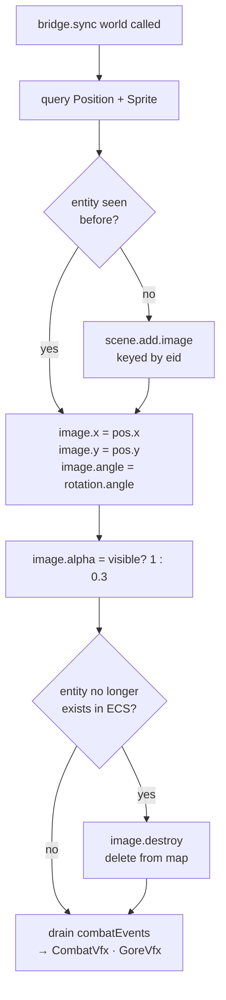
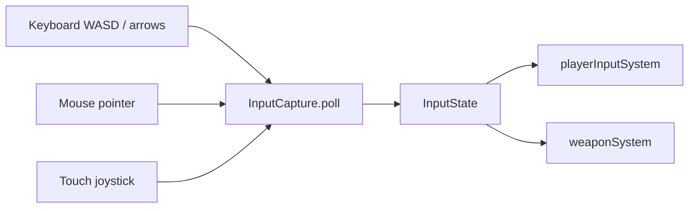
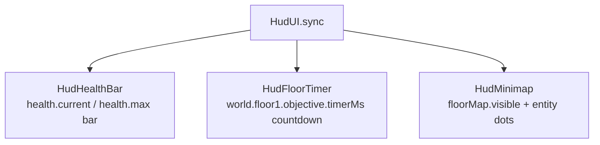
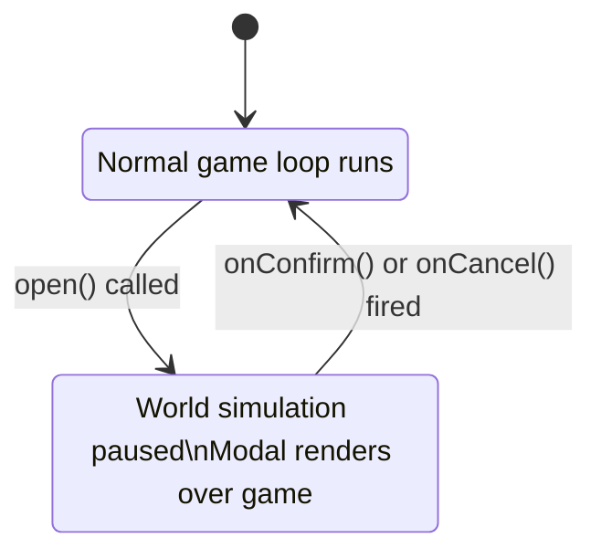
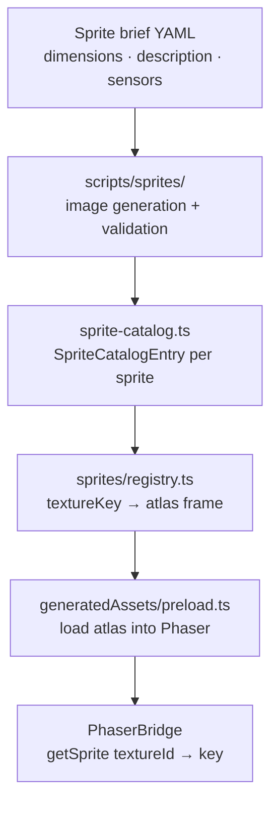

# Engine Bridge & Rendering Subsystems

**Status:** ✅ Implemented (sprite catalog 🚧 partial coverage)  
**Layer:** `src/engine/`  
**Labs:** `hud-lab`, `gore-lab`, `sprite-catalog-lab`, `sprite-gallery-lab`, `anchor-lab`

---

## Subsystems in this group

| Subsystem          | File                             | Role                                     |
| ------------------ | -------------------------------- | ---------------------------------------- |
| `PhaserBridge`     | `src/engine/PhaserBridge.ts`     | ECS → Phaser GameObject sync             |
| `InputCapture`     | `src/engine/InputCapture.ts`     | Keyboard + touch → InputState            |
| `HudUI`            | `src/engine/HudUI.ts`            | Facade: HealthBar + FloorTimer + Minimap |
| `HudHealthBar`     | `src/engine/HudHealthBar.ts`     | HP bar synced to health component        |
| `HudFloorTimer`    | `src/engine/HudFloorTimer.ts`    | Countdown from floor timer               |
| `HudMinimap`       | `src/engine/HudMinimap.ts`       | Pixel-per-tile minimap with FOV          |
| `CombatVfx`        | `src/engine/CombatVfx.ts`        | Hit flashes, damage numbers              |
| `GoreVfx`          | `src/engine/GoreVfx.ts`          | Blood splatter particles                 |
| `ModalPickerUI`    | `src/engine/ModalPickerUI.ts`    | Pause-over option picker                 |
| `InventoryUI`      | `src/engine/InventoryUI.ts`      | 🚧 Inventory display                     |
| `sprites/registry` | `src/engine/sprites/registry.ts` | Texture key → Phaser frame lookup        |
| `sprites/index`    | `src/engine/sprites/index.ts`    | `getSprite()` entry point                |

---

## PhaserBridge

### What it does

The bridge is the **only** path from ECS state to Phaser's rendering layer. It is called once per Phaser render frame (`bridge.sync(world)`) after all simulation steps complete. It:

1. Queries every entity with `[Position, Sprite]`.
2. Creates a `Phaser.GameObjects.Image` on first sight (keyed by entity id).
3. Each frame: syncs `.x`, `.y`, `rotation`, `visible` (from `floorMap.visible[]`) to the Image.
4. On entity removal: destroys the corresponding Image.
5. Drains `world.combatEvents` and dispatches them to `CombatVfx` and `GoreVfx`.

> **One-way dependency:** PhaserBridge reads ECS state; it never writes back to ECS.

### Contract

```
Reads:   Position.x/y, Sprite.textureId/width/height, Rotation.angle
         floorMap.visible[] (for fog-of-war alpha)
         world.combatEvents (drained — consumed once)
         Player, Enemy, XpGem, Projectile, MeleeSwing, LineDamage, Trap,
           AoeOnImpact, Returning, DeathTimer tag components
Writes:  Phaser GameObjects (create / update / destroy)
         CombatVfx.handleEvents, GoreVfx.handleEvents
Side effects: none to ECS; combatEvents list cleared after processing
```

### Sync loop



### Texture generation

On first `create()`, `PhaserBridge` generates procedural textures for placeholder sprites (player diamond, enemy square, gem circle, bullet, etc.) using `scene.add.graphics()`. When generated asset textures are available from the sprite catalog, they are used instead.

---

## InputCapture

### What it does

Wraps Phaser's keyboard input and a virtual on-screen joystick (mobile). Exposes a `poll(inputState)` method that is called once per simulation step. Also supports a `getFollowOrigin()` callback to anchor the mobile joystick to the player's screen position.

### Contract

```
Reads:   Phaser keyboard (WASD, arrow keys, mouse position for aiming)
         Pointer/touch for mobile joystick
Writes:  inputState.{moveX, moveY, aimX, aimY, shootHeld}
         (pure write — no reads from ECS)
```

### Input flow



---

## HudUI

Facade that owns three HUD elements. `sync(world, playerEid)` is called every Phaser render frame.



### HudHealthBar

Reads `stores.health.{current, max}[playerEid]`. Renders a coloured bar that transitions green → yellow → red as HP falls.

### HudFloorTimer

Reads `world.floor1.objective.remainingMs`. Shows `MM:SS` countdown. Turns red when under 60 s.

### HudMinimap

Renders a scaled-down version of `floorMap.terrain` (pre-baked once). Each frame, overlays:

- Visible tiles at full opacity (white dot per tile if visible).
- Player position (green dot).
- Enemy positions within FOV (red dot).

---

## CombatVfx

### What it does

Consumes `CombatEvent` objects drained from `world.combatEvents`. For `'hit'` events: spawns a brief hit flash at the target position and a floating damage number. For `'blocked'` events: shows a "❌" or "shield" indicator.

### Contract

```
Reads:   CombatEvent[] (drained by PhaserBridge each frame)
Writes:  Phaser Tween / Text GameObjects (auto-destroy after animation)
Side effects: none to ECS
```

### Event types handled

| Event type  | Visual                                    |
| ----------- | ----------------------------------------- |
| `'hit'`     | Hit flash circle + floating damage number |
| `'blocked'` | "❌" text at hit position                 |
| `'death'`   | Dispatched to GoreVfx                     |

---

## GoreVfx

### What it does

Handles `'death'` combat events. For each death event, spawns blood splatter particles at the entity's last position. Intensity scales with `goreFactor` (0–1) from the killing weapon's `WeaponDef`.

### Contract

```
Reads:   CombatEvent (type='death') with position + goreFactor
Writes:  Phaser Particle emitter burst (auto-destroy after emission)
Side effects: none to ECS
```

---

## ModalPickerUI

### What it does

A modal overlay that **pauses the simulation**. When open, `MainGameScene.update()` skips the fixed-step pipeline (world stays frozen). Used for:

- Loadout selection (starter weapon choice at floor start).
- Level-up point allocation (planned — currently handled by keyboard keys 1/2/3).

### Contract

```
open(config: ModalConfig, callbacks: {onConfirm, onCancel})
isOpen(): boolean
destroy()
```



---

## Sprites subsystem

### How it works

The sprite pipeline generates PNG sprite sheets from AI-authored briefs (via the scripts in `scripts/sprites/`). Generated assets are cataloged in `src/shared/sprite-catalog.ts` and registered in `src/engine/sprites/registry.ts`.



`getSprite(textureId)` returns the Phaser texture key or falls back to a procedural placeholder if the sprite is not yet generated.

---

## Full engine data flow

```mermaid
graph TD
    subgraph ECS["ECS World (core + game)"]
        SIM[Simulation pipeline\n60 Hz fixed step]
        EVTS[combatEvents[]]
    end

    subgraph Engine["Phaser 4 Engine"]
        IC[InputCapture]
        BRIDGE[PhaserBridge]
        HUD[HudUI]
        VFX[CombatVfx · GoreVfx]
        MP[ModalPickerUI]
    end

    IC -->|InputState| SIM
    SIM -->|ECS state| BRIDGE
    SIM -->|combatEvents| EVTS
    BRIDGE -->|reads| EVTS
    EVTS -->|drained| VFX
    BRIDGE -->|calls each frame| HUD
    MP -->|isOpen check| SIM
```
